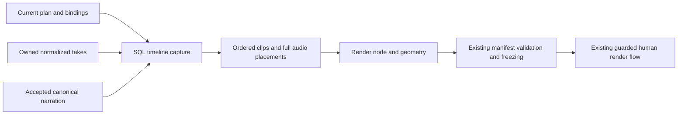

# Shared timeline capture

`media/timeline-capture.ts` extracts the SQL-only input resolver previously inside `MediaApplicationService`. It makes an exact timeline snapshot available without requiring a render node. The human render service delegates to the same resolver and retains its saved target/input shape, ordering, digest semantics and authorization flow.



The exported contracts are:

```ts
interface CapturedTimeline {
  target: Omit<RenderTarget, "renderNodeId">;
  input: Omit<RenderManifestInput, "width" | "height">;
}
interface CapturedRender {
  target: RenderTarget;
  input: RenderManifestInput;
}
captureTimeline(store: Store, projectId: string, timelineNodeId: string): CapturedTimeline;
captureRender(store: Store, projectId: string, renderNodeId: string): CapturedRender;
```

Both functions execute synchronously within a short Store transaction, including when nested in an existing transaction. They read detached project records and create no messages, holds, grants, attempts, jobs, manifests or events. They perform no media-file reads, subprocess work or network calls. The interfaces are trusted server primitives, not browser/model endpoints; callers must not expose their internal source descriptors or extend them with host paths in public output.

Capture verifies the current active plan and exact node bindings, cut-only ordered timeline inputs, same-project artifact identities, nonfixture provenance, measured video descriptors and current generated-shot intent/timing. It resolves narration through the current canonical record and exact accepted cues. Every selected placement preserves the complete service-issued source descriptor, source sample start, sample count, timeline sample offset and gain. Repeated audio references and their existing order remain intact. This matters because equal audio file hashes and equal cue fingerprints do not imply equal source trims or gain.

Standalone timeline capture omits output geometry and the render-node dependency. Render capture adds the exact current render node, width and height while preserving the legacy `RenderTarget` and `RenderManifestInput` structures. Target revision, plan, input references, canonical narration identity, dependency nodes and scopes remain available for a caller's later publication comparison. Capture is a snapshot, not a promise that the project will remain unchanged after the transaction.

The caller still owns authorization, pause/hold handling, executor identity, resource admission and final publication. `LocalMediaService.freezeManifest()` still validates geometry, sample/frame bounds and service-issued descriptors; rendering still verifies actual source bytes, toolchain identity and decoded output. A successful SQL capture alone does not certify that media bytes exist or are intact. `MediaApplicationService` retains its existing checks before and after asynchronous work, historical-output behavior and filesystem receipt recovery.

This extraction does not add automatic assembly, change Engine execution or cache identities, upgrade capability locks, or enable paid generation. An automatic local executor will need those separate boundaries before consuming this snapshot.

## Verification

Server build passed. **74 checks passed with zero failures/skips**: 19 new capture checks (including nested cases), 41 unchanged media/render/narration-canonical/ingestion checks, and 14 unchanged media/narration HTTP checks. The HTTP run used normal local loopback permissions. No model or media API calls occurred.

The focused capture suite covers a timeline with no render node or media files, unchanged database/authority state, detached return values, exact legacy render serialization/digest and repeated audio order, full sample/gain identity, fixture/foreign/missing/mismatched records, stale bindings, generated-shot scope and intent, and withdrawn narration acceptance. Existing integrations exercise actual local FFmpeg rendering, source-byte corruption detection, accepted narration, pause/cancellation, late historical outputs and receipt recovery across backend restart without another render.
