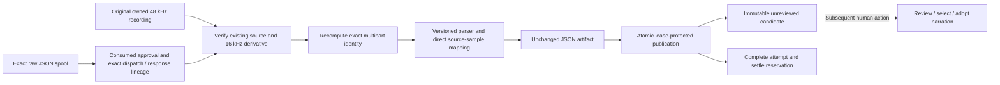

# Unreviewed transcript candidates

September 12, 2026. **Implemented and verified offline through explicitly configured Engine ingestion.** Candidate persistence builds on [owned transcription audio](TRANSCRIPTION-AUDIO-PREPARATION.md) and [exact execution mapping](OPENAI-TRANSCRIPTION-EXECUTION.md). Human adoption, browser review and audio activation remain subsequent work.

A transcript is evidence about one exact recording. It cannot prove that the user accepted its wording, that its timestamps are accurate, or that it aligns an already written script. Preserve those distinctions through the data model and later UI.

| Component | Responsibility |
|---|---|
| `transcript-candidate.ts` | Bounded immutable candidate, deterministic IDs, exact historical lineage and projection validation |
| `SpoolTranscriptIngestor` | Verify existing source/derivative/raw bytes and actual wire identity; preserve original JSON and return a tagged candidate |
| `ExecutionIngestionRouter` | Explicit `transcription` handler for the exact supported adapter and response role |
| `Engine` | Snapshot returned data, verify artifact bytes, repeat lineage checks under its current lease and publish atomically |
| Store and backup closure | Reject changed identities/projections; require reciprocal candidate/artifact records and independently reparse raw bytes during backup inspection |

## Data boundary

The first parser handles the OpenAI `whisper-1` verbose JSON word response. Expose its existing projection version and pure parser from the provider package, preserving transport result hashes. Other adapters can supply their own versioned response parser and the same provider-neutral timed-word input. Do not interpret arbitrary JSON as a transcript merely because its output port is named `cues`.

Persist the winning raw JSON spool unchanged. A candidate binds project/attempt/full request digest, raw receipt and spool IDs/hash/length, exact transcription-input derivative receipt/digest, complete original source descriptor/hash, parser identity/version, semantic transcript digest and source-sample mapping policy. The raw data artifact's hash is the raw response hash; candidate projection identity is separate. A vendor response cannot select these application identities.

The implemented application bridge persists the exact derivative/wire request mapping before its one-use dispatch marker. Candidate ingestion must verify that mapping against the admitted attempt and saved derivative, rather than infer what was uploaded from a matching response shape. The standalone parser and a prepared derivative do not supply that missing dispatch evidence.

Candidates are immutable and unreviewed. SQL publication of the raw data artifact and candidate is atomic under the original current ingestion lease, while the spool remains recoverable if SQL fails. The explicit data ingester accepts only a supported exact parser/adapter contract. No default JSON-to-cue conversion occurs. A successful candidate may have no speech or unresolved timing issues; neither is automatic retry permission.

The implementation uses the raw spool as its durable checkpoint; deterministic projection needs no additional conversion intent or filesystem completion family. `resolveTranscriptionSpoolLineage` independently verifies consumed authority, mapping, dispatch, completed observation, preparation and exact winning receipt, including when Engine recovers bytes before calling provider lookup. The ingester verifies the original owned source and derivative, recomputes the multipart identity, and parses the saved raw bytes without preparation, conversion, credentials or HTTP.

Publish unchanged response JSON at `artifacts/<project>/<raw-sha>.json`. A tagged `transcript_candidate` ingestion result carries that artifact and the immutable candidate into Engine's existing lease-protected transaction. Snapshot the result before awaited verification; atomically publish artifact, candidate, completed attempt, reservation settlement and any still-current binding. A normal artifact result cannot bypass this required tag for the supported real transcription adapter. Neither publication nor settlement writes narration acceptance or canonical cues.

Candidates store original text and seconds once in the mapped-word array, with separate parser and sample issues. Reconstruct the provider projection from those words to verify its existing fixed `JSON.stringify` digest; a core canonical digest is a different identity. Cap the candidate canonical body at 12 MiB, raw JSON at 4 MiB, parser issues at `3N + 2` and sample issues at `5N`, with the existing 8,192-word limit. Use deterministic IDs and retain `status: "unreviewed"` as immutable history. Backup includes the raw artifact and recomputes projection from required raw bytes; unresolved raw evidence without a published candidate keeps its existing recovery semantics.

## Timing algorithm

`mapTranscriptWordSamples` uses the provider-neutral policy `seconds-to-48k-half-up-v1`. It maps each original timestamp exactly once with `floor(seconds * 48000 + 0.5)`. The derivative and full source have the same time origin. Never first round to 16 kHz, add project placement, stretch for endpoint differences, clamp to source duration or sort provider words.

Parse using the measured derivative duration (`derivative.sampleCount / 16000`), exactly as the original transport did. Map separately against the original source endpoint at 48 kHz. Their small allowed measured endpoint difference must not silently change parser issues or the saved result digest.

The projection keeps original text and seconds, nullable source-local integer coordinates and explicit issue codes. Numbers beyond safe integer mapping retain their raw finite seconds and receive `unsafe_sample_coordinate`; no invented coordinate replaces them. A timestamp past the source endpoint receives `source_range_exceeded` even when integer rounding happens to land on the endpoint. Zero/sub-sample intervals, nested overlaps and nonmonotone order remain visible. Preserve the parser's separate issues, including transcript/word text mismatch and reported duration. Do not invent confidence or label this forced alignment.

The mapper accepts at most 8,192 words of at most 1,024 UTF-8 bytes and a measured positive source duration of at most six minutes. Its output is a suggestion, not `NarrationCue` or canonical state. The five initial helper checks cover one-round fractional boundaries, six-minute endpoint behavior, nested overlap, unsafe numbers and malformed/no-speech inputs. Candidate ingestion adds separate source, byte, provenance, publication and recovery checks; human adoption needs its own later verification.

## Recovery and verification

`SpoolTranscriptIngestor(outputs, media, transcriptionAudioStore, {artifactDir})` uses existing local media only to verify its owned descriptor and complete PCM. It never probes a current binary, runs conversion or calls a provider. Reads check bounded complete bytes, exact hashes/EOF, unchanged file metadata, canonical private directories and the original signal/lease. Artifact installation uses a private temporary file, exclusive publication, existing-byte verification and directory flushes. A corrupt existing artifact is rejected rather than overwritten. Late cancellation can retain an immutable file while preventing SQL publication.

An interrupted publication is deterministic to repeat. Candidate insertion, artifact insertion, attempt success, reservation settlement and current binding selection occur together. On SQL rollback the attempt remains ingesting with reserved liability; the retained raw spool and any installed JSON file supply local recovery. A replacement owner can recover the result; the obsolete owner cannot publish it. Changed or missing authority, dispatch, source/derivative or the exact response receipt prevents candidate publication. Identical bytes from a different winning receipt are insufficient. Such a conflict retains evidence and liability rather than triggering another paid request.

The initial actual two-node Engine proof passed 14 checks using synthetic HTTP and real FFmpeg. It forced both raw-spool SQL failure and later candidate-insert SQL failure, reopened twice with media binaries/preparation/credentials unavailable, and published one unreviewed candidate. Exactly one speech request, one transcription request, one normalization and one derivative conversion occurred. Two admitted reservations settled only after their corresponding outputs became usable. Original canonical project and narration acceptance remained unchanged. Independent audit passed 29 checks and retained complete unchanged hashes for all 20 original files. The six actual Engine checks cover exact publication, rejection of an ordinary artifact in place of a candidate, forged projection, SQL rollback/reopen, lease replacement and a conflicting same-byte winning receipt that would otherwise bypass provider lookup. The initial forged-projection test used an incorrect English-message regex; the observed rejection was correct, and its corrected stable-code assertion passed.

A separate actual backup/restore campaign passed 27 checks and a read-only audit passed 23. It exported after candidate SQL failure, preserved all 19 original files in an archive, and restored to the same canonical root. Quarantine blocked worker writes; exact human release retained project pause and permanent imported first-POST fences. The real reconciler then published the existing candidate and settled its historical reservation once, with no repeat HTTP, conversion, credential resolution or narration acceptance. Five expected ownership/SQLite runtime files were recorded separately from preserved source content; the final required manifest contains 17 files. This exercised the trusted release function with a synthetic human principal, not a browser release.

The final complete checkout passed **1,217 tests with zero failures, cancellations or skips**, all builds/typechecks and the installed no-turn Codex probe. The added 44 checks cover the candidate, provider projection digest, raw ingester, Store/backup, Engine and exact router. No native model turn or live media API call was made for this milestone.

See [sanitized evidence](transcript-candidate-evidence.json) and [current checkout status](STATUS.md). The next attachment slice is [generated narration provenance](GENERATED-NARRATION-ATTACHMENT.md).

## Human review and later integration

A paged candidate view should show recording identity, unedited transcript, timing issues and stale-source status. Let the user edit wording and choose exact words/ranges to use. Applying a selection needs a fresh current narration request, expected narration version and exact source/script revisions. It creates new human-selected cues with an audit link to the candidate; script, recording and timing acceptance remain independent. Accepted existing segments remain untouched unless explicitly changed.

This integration must also preserve generated-audio provenance. Historical `NarrationAudio.declaredOrigin` is a human label for a supplied recording. Add a separate verified generated-source variant; never replace provider/derivation evidence with an invented upload request. Canonical provenance must carry that variant through narration-only and scoped shot changes.

Include all actual candidate records/files in backup closure from their first shipped slice. Restored candidates stay historical suggestions and grant no new paid submission or adoption. Verify exact raw/semantic identities, forged source/dispatch rejection, SQL failure/reopen, quarantine/restore, empty speech, difficult timestamps, stale selection and unchanged human acceptance before exposing this path in tools or the browser.
