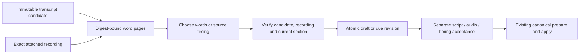

# Review and adopt transcript evidence

September 12, 2026. **Implemented and verified offline.** Immutable, unreviewed transcript candidates preserve exact source, parser and provider history. Generated-recording attachment is implemented separately. A human can use an existing transcript when writing a section or choosing its source range. New transcription, automatic script alignment and paid audio activation remain separate work.

## Review model

Show recognized words beside the currently saved section and its attached recording. Label recognition and timing as suggestions. Preserve the candidate unchanged even after the human uses part of it; adoption creates separate editorial history. A candidate is evidence about its exact audio waveform, not proof that the current script was spoken.

List a bounded page of completed candidates for the selected recording, then fetch bounded pages of words by original zero-based index. Bound candidate IDs and serialized row lengths in SQL before parsing; a candidate can occupy 12 MiB, so never load the entire history to return one page. Cap returned page bytes as well as word count. Bind each page to the candidate ID and digest. Preserve the original word order, reported seconds, mapped 48 kHz source samples and issue flags. Do not silently sort, clamp, fill gaps or convert indices into timeline positions. The UI can show readable seconds while submitting the original indices and exact candidate identity.

Use two explicit actions so writing and timing remain independent:

| Action | Human choice | Result |
|---|---|---|
| Use recognized words | One contiguous word range and its displayed text | A successor script draft for the selected section; existing meaning, language, source preferences and video placement remain |
| Use suggested timing | One contiguous word range for the current attached recording | A successor source cue bound to the current script revision and exact candidate selection |

Neither action accepts script, recording or timing. Existing acceptance controls remain the only way to make those decisions. The human can subsequently edit recognized wording or enter a manual range. Transcript suggestions never trigger automatic audio regeneration.

The first version updates one existing section at a time. A human can create a blank section and attach its recording before using recognized words. Both actions require the exact recording to be attached already. Automatic splitting into many sections, script-to-transcript sequence matching, speaker attribution and karaoke highlighting are deferred. Do not add those heuristics to the initial selection action.

A read-only range-preview endpoint uses the same pure rendering and timing rules as the mutation. It returns the exact proposed words, their digest, source range and relevant issues for the chosen indices. This supports selections spanning several word pages without asking the browser to reconstruct unseen text or duplicate policy. Preview creates no request, hold, selection receipt or acceptance.

Initial read surfaces are candidate summaries under `/narration/audio/:audioId/transcripts`, indexed `/narration/transcripts/:candidateId/words` pages, and an exact `/selection` preview. Scan at most 20 candidate IDs and 16 MiB of serialized candidate bodies per listing request; adapt word pages within 64 words and 64 KiB. Return scan/continuation coverage even when filtering produces an empty page. Both human actions submit the same candidate, audio and index identities plus `selectedTextDigest = digest({policy:"trim-join-ascii-space-v1",text})`; they submit no timestamps or actor claims. Writing uses `/narration/transcript-words`, timing uses `/narration/transcript-timing`, with the current session and existing idempotency header.

## Identity and mutation boundary

The command pins narration version, section ID/revision, attached audio ID, candidate ID/digest, action and inclusive-start/exclusive-end word indices. Capture the original human request and cancellation signal before asynchronous verification. Resolve an exact successful command replay after the actor/recovery fence and before current-version or media reads, as in generated-recording attachment. Repeat current authority, section, source and evidence checks in the publication transaction. A later request cannot authorize an earlier unfinished selection.

Require the candidate's full retained transcription lineage, a succeeded attempt with `outputs.cues` equal to the exact published response artifact, and a charged reservation. Historical results need not remain the active node binding. Its pinned original source descriptor must equal the currently attached recording descriptor, including artifact ID, hash, geometry and sample count. Equivalent `media_source` and `narration_audio` records must not rewrite the candidate's earlier pinned source reference. A transcript of another take remains in history but cannot supply timing for this recording. Selection indices satisfy `0 <= start < end <= wordCount`.

Verify the existing owned recording and exact raw response bytes before first publication, without conversion, provider calls or current media binaries. Reuse the candidate parser/projection validator and bounded source verification; do not invent a second timestamp conversion policy. Missing/corrupt evidence produces a review error and preserves the draft.

Create a small immutable transcript-selection record that links the original request, candidate/digest, selected indices, selected word-text digest, source identity and input/output section or cue identities. New script/cue outputs retain a direct immutable link to this selection. Allocate one UUID for both the selection and its output, in their distinct entity families: the output stores the selection ID, and the selection stores the full output digest. This avoids a digest cycle and lets validators find required provenance by output ID even if a backlink is removed, without a history scan or another relation family. Use the existing narration revision and command transaction for publication. This record is needed because a transcript-derived cue must retain its derivation after later narration edits; it is not a new spending or acceptance record. A true no-op writes only the existing command receipt for replay, with no new action event: no narration version/revision, output, backlink, selection or acceptance changes. Add this behavior explicitly for the new callbacks while preserving older mutations' behavior.

For writing, version the initial rendering rule: trim each selected word's outer whitespace, join with one ASCII space and preserve its remaining content. Show the exact result before submission and bind its digest. Set `textKind:"draft"`; leave meaning for the human to supply or confirm. Do not claim original punctuation can be reconstructed from word timestamps. Reject a selection exceeding the existing section text limit instead of truncating it. A changed script follows existing revision invalidation: clear its script/audio/timing acceptance and old cue while retaining the selected recording and placement. No-op means the complete resulting draft is identical; notes becoming a draft is a revision even when the words match. A no-op must not silently invalidate accepted work. Timing issue flags do not prevent writing-only use.

For timing, take the mapped start of the first selected word and end of the last selected word. Require finite safe integer coordinates, positive in-source duration, monotone non-overlapping selected words and no parser/sample issue attached to any selected original word index. This includes an overlap reported against a word outside the selection. A global reported-duration-outside-source issue blocks suggested timing; text/word mismatch remains a visible writing warning because the selected word strings are shown explicitly. A flagged endpoint remains unusable even if rounding happened to place it on the source boundary. Explain that the human can choose a smaller valid range or enter a manual range; do not silently correct the candidate. Gaps between words are retained. Project placement remains separate and unchanged.

Extend the narration cue model with an explicit transcript-selection provenance variant; preserve old human cue JSON exactly. Retain this through a keyed immutable cue-to-selection relation and canonical narration provenance. Keep the existing core `CueRecord` projection bytes unchanged; its `measured:true` describes measured-source coverage, not a guarantee of recognition or forced alignment. A changed cue clears timing acceptance only. Existing script and audio acceptance remain valid when their exact subjects have not changed. Identical source endpoints preserve the existing cue, provenance and acceptance, including when the current cue was entered manually. Canonical history/backup must retain and validate the selection closure; it must never relabel a transcript-derived range as a manually supplied range.

Use an optional canonical segment `transcriptProvenance` property with independent `writing` and `timing` selection ID/digest links, alongside the existing audio provenance. Omit it entirely when neither output has a backlink; preserve both existing audio-provenance variants. Validators derive the required links from saved outputs rather than trusting the presence of an incoming tag. A manually revised script drops its direct backlink while retaining prior history. A later audio replacement may retain a transcript-derived script as writing history from the earlier take; timing must still describe the currently selected script and audio. Placement-only edits preserve source-local timing provenance and take project placement from the current immutable narration revision.

## Components and verification

Implemented components include bounded read projection, pure selection/provenance rules, read-only physical evidence verification, human service actions, Store/backup closure, authenticated routes and browser review. Keep raw transcripts out of routine director context pages; expose bounded summaries and truthful application capability facts. Do not change the locked V2 mutation schema implicitly. A later conversational proposal needs a versioned tool and explicit human selection semantics.

Tests cover valid partial selection, writing-only and timing-only changes, exact no-op behavior, wrong take/project/digest, stale original request and section, original cancellation, lost-response/concurrent replay, invalid or flagged timestamps, oversized text, SQL rollback, preserved acceptances outside the changed subject and immutable candidate history. Canonical application and actual same-root backup/restore preserve transcript-derived cues. The built-browser proof compared recognized words, used a valid range and preserved the exact result across two restarts. A direct authenticated timing request for the flagged end word was also rejected, with unchanged state and no new provider or conversion work.

Next, follow the reviewed [audio activation and narration planning sequence](AUDIO-ACTIVATION.md) to connect ordinary audio creation to the existing spending/admission framework. Automatic transcript-to-script matching can then be added as a separate proposal stage whose ambiguous results remain human review choices.

Activation must also allow transcription of an owned uploaded recording before script or timing acceptance. Today a draft supplied recording is not automatically a compiler-visible project artifact; only completed generated output and accepted canonical source are available through that path. Add a trusted owned-source planning contract at activation rather than forcing a user with audio-only input to invent and accept a script before transcription. This adoption slice consumes already completed candidates and does not implicitly broaden compiler source authority.

## Verification evidence

The complete checkout passes **1,306 tests**, including 46 additions, with all builds/typechecks and the installed no-turn Codex compatibility probe passing. All 311 captured source/test/configuration/style files remained unchanged during the check. Focused suites overlap with that total.

The built browser used a six-second synthetic tone and an injected two-word transcript. It changed the saved section to “Leather boots”, retained meaning and recording, then selected only the valid first word at samples 1–12,000. Script and recording acceptance survived the timing change; repeating identical timing preserved every acceptance and revision. Separate timing acceptance and canonical application retained independent writing/timing provenance alongside full generated-audio evidence. The original six-second recording remained complete.

Independent audits passed **35 checks plus seven final-reopen checks**. Seven HTTP checks covered exact command replay after restart, conflicting reuse and unsafe timing rejection; two final restart checks verified canonical state and the full playback artifact hash. All 41 protected rows across 28 kinds and all 15 captured managed files remained unchanged. Read-only review created no authority or editorial state. Both restarts and all owned launcher shutdowns completed cleanly.

Independent review closed a supplied-audio canonical provenance gap: transcript-bearing canonical records must retain the exact existing supplied-audio origin, toolchain and human acceptance evidence too. Legacy unlinked records remain compatible.

This is synthetic media and injected recognition evidence, not speech quality, real ASR, forced alignment or ordinary paid audio activation. The final playback check verified HTTP bytes; a later browser playback inspection did not run because the temporary tab had already closed. No native model or live media API calls were made. See [sanitized evidence](transcript-review-evidence.json).
