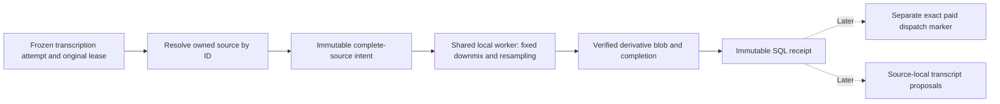

# Owned transcription audio preparation

September 12, 2026. **Implemented and verified offline.** This refines the derivative step in [generated audio ingestion](GENERATED-AUDIO-INGESTION.md). It adds no paid provider registration, narration acceptance or browser workflow.

The transcription transport already accepts a complete 16 kHz mono PCM recording. OpenSlate's owned narration sources are 48 kHz stereo. Produce a separate, measured upload derivative while retaining the exact original source and its time origin. This is local preparation for an already admitted transcription attempt, not permission to submit it.

## Ownership and authority

The application wrapper receives the captured attempt, its original lease owner/epoch and original cancellation signal. Require a stored transcription request with exactly one audio input. Resolve that input against a same-project `media_source` or `narration_audio` record, retaining the record kind, ID and digest. The selected descriptor's artifact ID and hash must match the frozen input. Conflicting matching records fail explicitly; never accept a caller-supplied path, guessed current narration or source identity from a provider response.

The two source families deliberately include generated artifacts and human recordings that have not yet been accepted into canonical narration. Both are ordinary owned media for preparation; neither supplies script/timing acceptance. Retain the source descriptor, original provenance record and source bytes unchanged.

Creating an intent or starting a conversion requires the still-current original lease and first-submit recovery guard. The explicit [waiting protocol](AUDIO-PREPARATION-WAITING.md) additionally permits its proven `preparing` phase through the captured Engine context; ordinary service callers cannot bypass that protocol. Legacy callers retain the original submitting-phase rule. Quarantine blocks preparation. After human recovery release, an imported attempt may verify/recover an already completed derivative, but may not start a missing conversion or a first provider POST. Reusing a derivative never bypasses the later bridge's fresh dispatch check. A lost lease can leave immutable filesystem evidence; it cannot publish or borrow the replacement owner's authority.

## Records and conversion

Use separate `transcription_audio_intent` and `transcription_audio_receipt` entity families. An application-issued intent ID binds project, attempt and this derivative role. Store the full admitted request digest, exact source-record reference/digest and descriptor, complete range `[0, sourceSamples)`, and a versioned recipe with toolchain and actual bounds. The receipt binds its intent digest, exact derivative hash/length, 16 kHz mono PCM16 geometry and `endDelta48kSamples = derivativeSamples * 3 - sourceSamples`.

The worker must share `LocalMediaService`'s exclusive conversion slot. Use fixed argument arrays, owned verified input, a deterministic downmix (`0.5 * left + 0.5 * right`) and pinned 48→16 kHz resampling. No crop, seek, concatenation, trimming of silence, tempo or loudness changes. Measure complete PCM before and after conversion. Require positive source samples at 48 kHz stereo, at most 17,280,000 samples; derivative at most 5,760,000 samples and 25,000,000 bytes. Bound metadata at 32 KiB, and use the smaller configured worker limits where applicable. Preflight sufficient output capacity for all expected samples plus bounded WAV framing; a size-limited prefix must never count as success.

The initial endpoint policy allows an absolute difference of at most three 48 kHz samples, recorded without stretching the audio. Test lengths divisible and not divisible by three, including the configured maximum duration. A complete but unacceptable measured endpoint remains evidence; it must not become an automatic repeated conversion.

Add two fixed `LocalMediaService` operations: `describeTranscriptionAudio({signal})` and `deriveTranscriptionAudio({source, recipe}, {signal, assertCanStart, persistCompletion})`. The derivative method retains its exclusive worker and temporary directory while awaiting the trusted filesystem-only `persistCompletion(measured, temporaryPath)` callback. It returns measured metadata, never a temporary path. An outer `TranscriptionAudioStore` owns derivative installation/completion; the application wrapper owns SQL and authority. No generic command or caller-selected filter is exposed. Snapshot already-owned media through an internal verified copy path: the current external-input root allowlist may exclude `media.rootDir`, and must not be broadened to accommodate this operation.

Store derivative WAVs and keyed completions under `audio-derivatives/blobs/<sha>.wav` and `audio-derivatives/completions/<intentId>.json`. A 16 kHz derivative is not a new 48 kHz `SuppliedMedia`. Stream, hash, install exclusively and synchronize the blob before the completion; publish the exact SQL receipt last. Reuse a valid completion even when current tools are unavailable or have changed. Incomplete conversion requires the original pinned recipe/toolchain. A crash before completion publication may repeat local conversion, never the paid submission.

The filesystem sink keeps the original cancellation signal. Cancellation after decoding but before completion-index publication may discard that local result and require a later local conversion under valid authority; it never starts a provider call. Do not make finalization uncancellable merely to avoid this small local repeat. A completed durable index survives later cancellation. Late lease loss with a live signal may retain immutable filesystem evidence, but SQL publication and a usable return value still require the original current lease. After restoration, an existing completion can be recovered under a current `submission_unknown` lease; this does not allow that imported attempt to create a missing derivative or perform a first POST.

## Persistence and backup

Validate immutable references in Store and the same-root backup closure. Include derivative blobs and filesystem-only completions as soon as their producer ships; reject missing source bytes, changed provenance, mismatched input requests or receipt geometry. Restoration preserves source identity and permanent imported-authority fences. Temporary worker files remain excluded. No credentials, provider responses or new generation authority are required for this slice.

## Verification and following work

Use real synthetic PCM with channel-distinct tones, impulses and leading/trailing silence. Check explicit downmix, full decode, non-divisible endpoints, output-cap rejection, unchanged source bytes, source ownership, original-signal mutation, shared-worker contention, lease loss, SQL rollback/reopen and actual backup/restore. Inject no media network calls.

The transport's existing versioned parser is now reusable for raw JSON, and a provider-neutral helper maps original seconds once to 48 kHz source samples. They do not round through 16 kHz, add project placement, clamp, align acoustically or adopt cues. Unsafe numeric ranges retain original seconds with an explicit unmappable issue. Next implement [speech and transcription execution bridges](AUDIO-APPLICATION-BRIDGES.md), then [unreviewed candidates](TRANSCRIPT-CANDIDATES.md) tied to their exact derivative and dispatch mapping. Human adoption and activation follow separately.

## Implemented verification

The full checkout passes **1,064 tests with zero failures/cancellations/skips**, all builds/typechecks and the installed no-turn Codex probe. This slice adds 52 checks: 15 fixed-worker cases, 16 wrapper/storage cases, five backup cases, 11 parser cases and five timing-mapping cases. Independent worker review confirmed legacy operations retain their own configured timeout and output limits. Six comparisons against the preceding transport implementation preserved exact request descriptions, multipart bytes, receipts, raw responses and projection digests.

A separate 360-second proof passed **13 checks plus 23 independent read-only checks**. It used actual `NarrationService` recording import and a trusted preadmitted-attempt fixture, then converted all 17,280,000 source samples at 48 kHz stereo to 5,760,000 mono samples at 16 kHz. The derivative is 11,520,078 bytes, with zero endpoint difference. Full decoding verified complete duration, signal and edge silence. A forced SQL receipt failure left a durable filesystem completion; database reopen with unavailable executable paths recovered it without another conversion or toolchain lookup. Exact bytes were then compared through one injected multipart transcription request; parsing and direct source-sample mapping agreed. No narration, acceptance, canonical state or spending authority changed.

The private proof's manually inserted attempt exercises the host preparation contract; it does not prove Engine admission or a production paid bridge. The maintained backup test performs actual same-root restoration and explicitly simulates the existing reconciler's replacement claim for a `submission_unknown` attempt. The preparation component does not itself claim leases or dispatch providers. Quarantine/release and permanent imported first-submit denial are independently asserted.

Source resolution uses two keyed lookups, and backup memoizes successfully verified immutable identities within one inspection. The recorded edge-case decision preserves original cancellation before publication; once the completion index is durable, cancellation and SQL failure do not cause another conversion. All media/HTTP fixtures were synthetic or injected. See [sanitized results](transcription-preparation-evidence.json).
