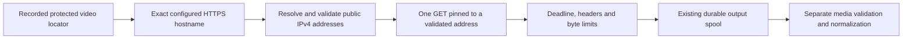

# Protected video output downloading

September 12, 2026. `ProtectedVideoDownloader` supplies a bounded byte stream from an already recorded video output locator to `ExecutionOutputStore`. It is implemented and tested offline, but is not wired to H3 or the application launcher. No real CDN request, account credential or media API call was used in verification.



The caller supplies a receipt previously admitted by the output store. The downloader snapshots its locator and expiry; it does not accept an arbitrary model URL, grant generation authority, change the task identity or publish an artifact. `ExecutionOutputStore.spool(projectId, receiptId, downloader.source(receipt))` retains the existing project/attempt/request binding and first-winning-slot rules. Replaying a completed spool or recovering its local completion does not reopen the stream.

## Network contract

Trusted host configuration must provide exact DNS hostnames. Wildcards, IP literals, local single-label names and URL-shaped configuration are rejected. Locators must use HTTPS on its standard port, without credentials or fragments. The implementation does not follow redirects or forward an API bearer token, cookie or caller-supplied header. It accepts only a complete HTTP 200 response; range responses are outside this slice.

The first version deliberately supports **public IPv4 only**. It resolves at most sixteen IPv4 answers, rejects a response containing a blocked address, and copies one validated address into the request's lookup function. Later mutation or DNS re-resolution cannot change that request's destination. The block list covers private, loopback, link-local, shared, documentation, benchmarking, multicast and reserved ranges, plus additional conservative exclusions. It is a destination policy, not a guarantee of network reachability. The special-purpose classifications are documented in the [IANA IPv4 registry](https://www.iana.org/assignments/iana-ipv4-special-registry/).

A fresh non-pooling HTTPS agent disables environment-proxy configuration and TLS session caching. TLS certificate verification stays enabled against the original hostname. The Node primitives used here are documented under [HTTPS agents](https://nodejs.org/docs/latest-v24.x/api/https.html#class-httpsagent), [DNS lookup](https://nodejs.org/docs/latest-v24.x/api/dns.html#dnspromiseslookuphostname-options) and [address block lists](https://nodejs.org/docs/latest-v24.x/api/net.html#class-netblocklist); the implementation was compiled and tested with Node 24.15.0.

Limits are 256 MiB of response bytes, 16 KiB of response headers, one-MiB yielded chunks and a five-minute total deadline. The host can lower byte/deadline limits. The deadline covers DNS, response headers and the body. Missing content length is supported; a supplied length must be a positive bounded integer and match the actual body. Encoded/compressed responses are rejected. A supplied content type must be MP4 or generic binary; decoding still happens later.

## Cancellation and failure

The original caller signal remains attached for the stream's lifetime. Cancellation or deadline expiration prevents subsequent network dispatch, destroys an active request/response and closes its private agent. Early consumer return also closes those resources. The stream waits for request closure before relinquishing its storage operation. A pending operating-system DNS lookup cannot be forcibly cancelled; its result is ignored after cancellation and cannot initiate a late GET.

There is no retry loop. An expired locator, rejected destination, non-200 response, invalid body, truncation or timeout leaves the provider receipt available for application recovery. The downloader does not classify the generation as failed, release liability or submit a replacement. Raw network error messages and signed URLs are absent from returned errors. Protected locators remain only in the existing protected receipt layer.

## Verification and limits

The server build and **13 focused tests passed**, zero failures/skips. Eleven transport tests inject DNS/request dependencies to cover pinned destinations, exact TLS/header options, caller mutation, destination rejection, redirects, status/format/size checks, chunking, expiry, DNS cancellation, header/body timeout, sanitized errors and consumer cleanup. Two tests connect that stream to the real output store: exact immutable publication and replay without another GET, plus failed-download receipt retention and staging cleanup.

The fixture body is synthetic bytes, not a decoded video. These checks do not establish a real CDN's hostname, DNS behavior, certificate, throughput, URL lifetime or H3 compatibility. Actual TLS and provider-origin acceptance require a later allowed live check. IPv6, proxies, redirects, ranges and automatic download retry are intentionally unsupported. The separate generated-video normalizer currently retains its stricter 128-MiB input cap; a stored 256-MiB response is not automatically renderable.

```sh
pnpm --filter @openslate/server build
node --test apps/server/test/video-download.test.mjs
```
