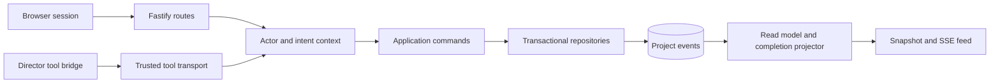

# Application Services, API and Events

**Version:** 0.4 · Proposed implementation design

## 1. Boundary and module ownership

The Fastify application is the local product boundary. HTTP routes and the director's tool bridge call shared application services; they do not issue SQL independently. The browser and director cannot write project files or admit provider work directly. Worker executor repositories advance jobs under the same current-state policy checks described in [persistence](DATA-PERSISTENCE.md).



Initial modules: `application/project-service`, `conversation-service`, `change-service`, `review-service`, `control-service`, `configuration-service`, `artifact-service`; `http/routes`; `events/projector` and `events/stream`. Keep domain schemas in `packages/core/contracts` and the Codex transport in `packages/director`. The service interface is independent of HTTP/MCP; a future CLI or direct timeline editor uses it too.

## 2. Commands, actors and idempotency

```ts
interface CommandContext {
  actor: { kind: "human" | "director" | "worker"; principalId: Id };
  projectId: Id;
  requestId: Id;
  correlationId: Id;
  idempotencyKey: string;
  authority: TrustedAuthority;     // constructed by authenticated transport
  directorInvocation?: {          // required for director actors only
    authorityRequestId: Id;
    authorizationEpochId: Id;     // immutable per call, checked at commit
    bridgeInstanceId: Id;
  };
}
interface ApplyPreparedChange {
  changeId: Id;
  expectedHeadVersion: number;
}
interface CommandFailure {
  code: string;
  message: string;
  retryable: boolean;
  details?: unknown;              // schema-specific safe diagnostics
}
```

Do not accept actor kind, approved status, spend authority, technical-failure evidence or hold ownership from model arguments. Transport authentication creates identity; the server resolves authority from recorded human messages/decisions, initial grants and execution evidence. A director tool-call ID is transport correlation, not durable user intent. Bind every tool command to a request capability and immutable authorization epoch, and revalidate the epoch at commit. Never assign late calls by whichever request happens to be current. The [runtime](DIRECTOR-RUNTIME.md) and [tool](SKILLS-TOOLS.md) designs define capability transport/fencing; revoke old authority before a replacement request can mutate state.

The implementation schema discriminates actor variants: director commands require `directorInvocation`; human commands use their authenticated session and recorded decision, while worker commands require their executor lease/fence context. `requestId` identifies the current command/request correlation; `authorityRequestId` identifies the immutable request that granted the director's rights. They must not be substituted for each other.

For browser commands, the client creates a retry-stable idempotency key before sending. The server stores `(actor scope, key, normalized request digest, status, response reference)`. Repeating identical content returns the earlier result; different content with the same key returns `IDEMPOTENCY_CONFLICT`. Expired HTTP connections do not imply failed commands.

For director calls, the supervisor assigns a persistent request ID linked to the initiating user request or trusted wakeup. `prepare_change` allocates one service-owned prepared-change identity for a scoped patch fingerprint; `apply_change` repeats against that identity. Initial plan grants contain immutable service-issued slots bound to permitted purpose and scope. Every creative candidate consumes one grantSlotId exactly once, independent of any recreated logical node. Additional user-directed candidates require specific new grant slots. New model tool-call IDs cannot bypass these constraints. There is no generic command allowing the model to approve its own output or increase an allowance.

JSON Schema is the shared wire contract. Use strict object schemas, discriminated variants, bounded string/array sizes and response validation. Do not silently coerce malformed IDs, strip unknown fields, or add creative defaults during transport validation. Fastify provides schema-based validation/serialization; expensive semantic/database validation belongs in services after parsing. [Fastify validation](https://fastify.dev/docs/latest/Reference/Validation-and-Serialization/)

## 3. HTTP surface

All routes below are proposed. The currently implemented `/api/health` remains the skeleton health endpoint until these slices ship. Resource IDs are opaque; route handlers verify project membership.

| Method and route | Request or result | Behavior |
|---|---|---|
| `POST /api/projects` | Name, desired duration, output format; project head | Create project; enforce supported duration/settings |
| `GET /api/projects/:id/snapshot` | Snapshot with `eventCursor` and resource versions | Consistent initial/reconnect state |
| `POST /api/projects/:id/messages` | Text, attachment IDs, selected context, optional active turn | Persist user request; schedule or steer a director turn |
| `GET /api/projects/:id/messages` | Cursor-paged public conversation | Include final text/decisions; no private reasoning |
| `POST /api/projects/:id/uploads` | Streaming multipart plus declared role | Stage bounded upload and return ingestion identity |
| `GET /api/projects/:id/artifacts/:artifactId/content` | Validated media with byte-range support | Stream local bytes for playback, scoped to session/project |
| `GET /api/projects/:id/reviews` | Pending/history, cursor, optional scene | Return immutable review snapshots and current validity |
| `POST /api/projects/:id/reviews/:reviewId/decisions` | Snapshot digest, explicit member IDs, approve/request-changes, optional comment | Human-only approval service |
| `POST /api/projects/:id/controls` | Pause/resume director or dispatch, scope, hold ID | Persist user controls; monitor accepted jobs separately |
| `GET /api/projects/:id/changes/:changeId` | Summary, impact, estimates, remaining decisions | Inspect a prepared proposal |
| `POST /api/projects/:id/changes/:changeId/decisions` | Accept/reject a presented expanded scope or plan | Human decision; service applies only compatible authorized change |
| `GET /api/projects/:id/debug/plan` | Source/graph/shot records and provenance links | Read-only, opt-in details |
| `GET /api/projects/:id/events` | SSE after cursor | Durable changes plus transient live text/progress |
| `GET/POST /api/settings/profiles` | Safe profile metadata or validated configuration | Backend-only credential references; no stored secret values returned |
| `POST /api/settings/credentials` | Credential value or environment reference | Human-only setup; save via selected credential backend |

No v0 route exposes arbitrary shot-field mutation as a public editor API. Creative requests use conversation; internal typed patch commands exist so future editor controls can reuse them. Approval/playback/pause controls are not a full timeline editor.

## 4. Message-to-change flow

1. Validate project/session, attachments and client-selected scope. Persist the user message and intent origin before starting model work.
2. If the user explicitly requests a scoped edit, create an edit hold for the known potential impact. With ambiguous scope, hold new project dispatch while asking a focused question. A UI selection is context, not approval of unseen changes.
3. Enqueue one director request. V0 scope- or authority-changing messages interrupt/drain the previous turn, revoke its tool authorization epoch, and start a new request after fencing; they do not use native steering. Informational steering is optional only when it leaves authority unchanged and the pinned adapter proves call attribution. Persist the new message/hold immediately while this happens. Never run competing automatic directors for one project.
4. The director reads state, proposes project-only changes or plan patches, and calls `prepare_change`. Store a typed proposal/read set and return a concise impact summary.
5. For work already authorized, the application may apply it without another redundant approval. New spend scope or creative ambiguity produces a recorded pending decision. Human keyframe review remains mandatory regardless of standing budget policy.
6. Apply under a revision- and epoch-checked transaction and emit events. Release only the edit's own hold when compatible executable bindings are restored; a project-only intent change that leaves the active plan stale retains the affected hold until planning catches up. Execution workers discover eligible work independently.

Plan approval covers the presented scene/narration direction and preparation allowance. It does not approve later unseen keyframes. A request such as “another take of shot 7 with the same setup” can carry creative authority for a new candidate while reusing current keyframe approval; it still passes budget and pause checks.

## 5. Human review and chat replies

A review snapshot is immutable: displayed artifact IDs/hashes, descriptions and relevant effective specifications. Client approval sends the snapshot identity/digest plus explicit covered member IDs. Revalidate those inputs transactionally before recording the decision. If a subset is stale, return `REVIEW_STALE` with the exact affected IDs and a fresh snapshot; do not silently approve replacements the user did not see.

Conversation can resolve a review only through application-controlled affirmative forms. A message must explicitly reply to a pending review decision ID whose snapshot was shown; the server uses a small full-message grammar for approval and optional explicit included/excluded shot labels. Bare “approve” or “yes” is valid only as a reply to that one review decision, never merely because a card is visible. Negative, conditional, quoted or unmatched text cannot grant approval. A model may propose a parsed intent, but anything outside the trusted grammar requires a concrete read-back/structured decision before commitment. Store the actual human reply and exact covered set. An unambiguous supported form such as “approve this scene except shot 8” can resolve a subset without a second review; an arbitrary “looks good” in general chat remains discussion.

Store review decisions independently of creative head changes. An unrelated edit does not expire valid approvals; altered keyframe bytes, motion, required conditioning, profile or consumed timing do. Refusing one shot blocks its dependent work, not all other approved scenes. Quality feedback creates a user-scoped edit request; it does not turn a valid clip into a technical-error record.

## 6. Events and consistent reconnect

Persist domain events in the same transaction as state changes. Useful kinds include `project.revised`, `change.prepared`, `review.requested`, `review.decided`, `hold.changed`, `attempt.state_changed`, `artifact.published`, `narration.cues_updated`, `preview.published`, `director.request_state_changed` and `message.completed`. Payloads carry IDs/versions and small summaries; media and full graphs are retrieved separately.

`GET snapshot` initially reads canonical tables and the matching event counter in one consistent read transaction. If a materialized/asynchronous read model is introduced, return its atomically stored applied-event watermark, never the newest event-table sequence ahead of that projection. This prevents reconnect from skipping events that the returned view has not applied. The client then subscribes after that cursor. SSE `id` is the per-project sequence; reconnect uses `Last-Event-ID`. Delivery is at least once, so the UI deduplicates by sequence/event ID. Do not let a later resource response overwrite a newer version already observed.

Transient text deltas and high-frequency progress are separate SSE event kinds without durable sequence IDs. Persist completed public messages and important attempt transitions; coalesce percentages and token deltas. After disconnect, the snapshot/final message reconstructs truth even if transient chunks were lost. Use bounded subscriber buffers; a lagging client receives a reset/reconnect instruction. If durable events have been compacted beyond its cursor, require a new snapshot.

The server completion projector consumes worker output events idempotently. It checks current node/candidate/spec and chooses eligible draft bindings; it never replaces user-accepted selections automatically. Preview promotion compares the frozen target identity, not just “job finished.” The worker itself publishes output and evidence, not creative selection heads.

## 7. Errors and control failures

| Code | Meaning and client behavior |
|---|---|
| `VALIDATION_ERROR` | Show field/DSL diagnostics; correction required |
| `REVISION_CONFLICT` | Reload relevant delta and reprepare; do not blind-resubmit the old patch |
| `REVIEW_STALE` | Refresh affected displayed inputs; ask for renewed decision |
| `AUTHORITY_REQUIRED` | Show exact unresolved user decision/scope; no agent self-approval |
| `CAPABILITY_UNSUPPORTED` | Offer validated model/format alternatives |
| `BUDGET_BLOCKED` | Show reservation/unknown liability and needed allowance |
| `SCOPE_HELD` | Show active holds and their owners; only authorized resume |
| `RUNTIME_UNAVAILABLE` | Preserve message/decisions and allow retry/reconnect |
| `SUBMISSION_UNKNOWN` | Show reconciliation status; never treat as safe to generate again |

Use HTTP 400 for transport validation, 401/403 for session/authority failures, 404 for inaccessible resources, 409 for revision/review/idempotency conflicts, and 503 for temporary runtime availability. Domain tool results carry the same codes rather than opaque stack traces.

The local server binds loopback and checks permitted Host/Origin values. Use a local authenticated session, CSRF protection for mutations and no wildcard CORS. Production media routes use the same session; never accept arbitrary file paths or remote fetch URLs in playback requests. Development Vite proxies the API. See [operations](OPERATIONS-TESTING.md) for credential and process setup.

## 8. Acceptance tests

Use service tests for authority/idempotency and Fastify integration tests for schemas/session/origin/route mapping. Race approval against a shot edit, reconnect between snapshot and subscribe, repeat a timed-out apply with a fresh model call ID, send an ambiguous chat approval, deliver an old render after a new target is selected, and reconnect while a projector is deliberately behind. Reject late old-epoch tool commands and negative/conditional/quoted review replies. Assert saved state and event sequence, not only HTTP status. Browser tests verify pending decisions survive refresh and can be resolved without restarting production.
