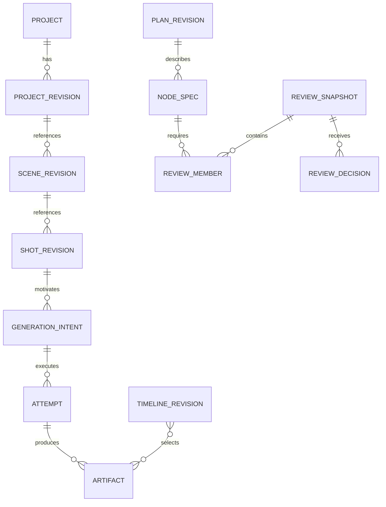

# Data Model and Persistence

**Version:** 0.4 · Proposed implementation design

## 1. Responsibilities and storage layout

Persistence owns canonical creative revisions, current bindings, durable execution evidence, review decisions and queryable history. It does not interpret prompts or invoke media APIs. Shared scalar conventions are defined in the [technical index](README.md).

Start with one installation database and content-addressed media storage under a configurable local data root, separate from the source checkout:

```text
data/
  openslate.sqlite
  artifacts/sha256/ab/<full-content-hash>
  staging/<attempt-or-upload-id>/
  skill-snapshots/<package-digest>/
  backups/<backup-id>/
  logs/
```

Database artifact records contain relative storage keys, media metadata and hashes, never signed cloud URLs as permanent media identity. Original files and every derived version remain immutable. File names shown to users are metadata, not filesystem authority. Secrets use environment/keychain adapters outside project exports.

Use `better-sqlite3` with separate application/worker connections and prepared statements. Enable foreign keys on every connection, WAL, a bounded busy timeout and `synchronous=FULL` for the paid-job state. SQLite WAL allows reader/writer overlap but still serializes writers and requires local shared-memory support; keep the database off network filesystems. The transaction layer uses short `BEGIN IMMEDIATE` sections for admission and head changes. [SQLite WAL](https://sqlite.org/wal.html), [Transactions](https://sqlite.org/lang_transaction.html), [Foreign keys](https://sqlite.org/foreignkeys.html)

Do not await network/media work inside a transaction. Driver transaction callbacks are synchronous; its API documents transaction helpers and backup facilities. Verify the selected package's Node 24 binary availability during the first implementation slice. [better-sqlite3 API](https://github.com/WiseLibs/better-sqlite3/blob/master/docs/api.md)

## 2. Ownership and revision structure



A project revision is a manifest of exact object revisions, not a duplicated film-sized JSON blob. Scene/shot/script revisions are immutable records containing validated JSON bodies plus indexed identity/parent fields. The schema remains relational around frequently joined identities; JSON is appropriate for evolving creative fields and provider-specific metadata. Foreign keys and write-time validation enforce all referenced revisions, including IDs contained in manifests.

| Record family | Essential fields and relationships | Mutation owner |
|---|---|---|
| `projects`, `project_revisions` | Project head/version, current plan/lock; immutable manifest, parent revision, user request and change ID | Application change service |
| `scenes`, `scene_revisions`, `shots`, `shot_revisions` | Stable IDs; ordered revision references; action/framing/motion; prompt provenance; narration cue and continuity references | Creative change service |
| `bible_revisions`, `semantic_links` | Character/product/location/style constraints; explicit influence type and source revision | Creative change service |
| `narration_revisions`, `script_segments`, `audio_segments`, `cue_revisions` | Text/audio readiness, approved text, immutable audio ranges, timing confidence and acceptance | Narration service |
| `capability_locks`, `profile_revisions`, `skill_snapshots` | Exact package/handler/compiler/runtime/profile identity; credential references only | Configuration/run transition service |
| `plan_revisions`, `plan_nodes`, `plan_edges`, `node_bindings` | Source/normalized graph hashes; stable logical node and immutable spec; execution dependencies; current candidate/output binding | Change service; executor updates eligible output bindings |
| `prepared_changes`, `commands`, `user_requests` | Base/head checks, request digest, scoped proposal, trusted origin, result reference and lifecycle | Application services |
| `review_snapshots`, `review_members`, `review_decisions` | Frozen displayed items/digests; per-member effective spec; trusted human decision and exact covered set | Human decision service |
| `holds` | Owner, project/scene/shot/node scope, reason, release status and originating request | Application control service |
| `generation_intents`, `grant_slots`, `candidates`, `attempts` | Immutable purpose-bound grant slot, authorization source, candidate identity, attempt retry authority, lease/fence, submission phase and status | Change service creates authorized intent; executor advances attempts |
| `provider_evidence`, `failure_records` | Append-only receipt/status/usage evidence; provider correlation; trusted technical-error classification | Executor/reconciliation service |
| `budget_policies`, `reservations`, `ledger_entries` | Policy version, scoped allowance, currency/units, estimated/observed liability, settlement evidence | Admission/accounting service |
| `artifacts`, `artifact_lineage` | Hash, storage key, media metadata, creator attempt or import; parent transformations | Artifact ingest service |
| `timeline_revisions`, `render_targets`, `render_results` | Exact media selections, frames/samples, mix/captions; frozen render manifest and output | Timeline service; renderer publishes results |
| `director_sessions`, `director_requests`, `request_activations`, `authorization_epochs`, `bridge_instances` | Opaque runtime mapping, pending turn, context revision set, selected skills; immutable authority-request/epoch/bridge association and revocation state | Director supervisor |
| `project_events` | Ordered durable changes, correlation IDs and typed payloads | Same transaction as owning mutation |

The record families are a migration plan, not a requirement to implement every table before the first slice. Introduce each family with the command and test that needs it. Separate creative state from execution progress so a provider poll does not create a new story revision or invalidate an unrelated prepared edit.

## 3. Key record shapes

```ts
interface ShotRevision {
  id: RevisionId;
  shotId: Id;
  projectId: Id;
  parentRevisionId: RevisionId | null;
  intent: { purpose: string; action: string; framing: string; motion: string };
  desiredFrames: number;
  cueRevisionId: RevisionId | null;
  constraintRevisionIds: RevisionId[];
  referenceArtifactIds: Id[];
  promptBinding: {
    imagePrompt: string;
    videoPrompt: string;
    authoredFromIntentDigest: Digest;
  };
}
interface CandidateOrigin {
  kind: "initial_slot" | "user_change";
  grantSlotId: Id;        // immutable service-issued purpose-bound slot
  authorityId: Id;        // trusted plan grant or user decision
}
interface RetryAuthority {
  failureRecordId: Id;    // trusted execution evidence, never a model label
  retryOrdinal: number;  // bounded; same candidate, new attempt
}
interface ReviewMember {
  shotId: Id;
  nodeId: Id;
  specRevisionId: RevisionId;
  conditioning: Array<{ destinationPort: string; role: string; order: number; artifact: ArtifactRef }>;
  effectiveSpecDigest: Digest;
}
```

Store actual derivative bytes used for conditioning before review. A review digest includes generation-relevant intent, normalized prompts/settings, conditioning roles/hashes, profile revision and consumed narration meaning/relative timing. Keep full cue/audio revision lineage separately for readiness and audit; a placement-only shift or replaced enclosing waveform is not a video input unless that operation actually consumes the audio. Render fingerprints include the exact waveform and absolute ranges. It excludes the candidate ID so an explicitly requested additional take can reuse unchanged approval. It also excludes arbitrary global project version and UI labels. The compiler supplies the normalized effective specification; the decision service and worker independently verify it against active bindings.

For automatic draft assembly, the server completion projector maintains a provisional selection separately from user acceptance. Workers only publish attempts, artifacts and guarded node output bindings, never creative selection or preview heads. A technically usable output can become a draft selection only while its logical node/candidate/spec still matches. A user's selected take is a creative change with an immutable new project/timeline revision. Final export acceptance records the exact render/timeline identity, not “whatever is latest.”

## 4. Constraints and indexes

Use explicit schema checks and composite ownership references. A child ID must belong to the same project; globally unique UUIDs alone do not enforce this. Representative constraints:

```sql
CREATE TABLE project_events (
  project_id TEXT NOT NULL REFERENCES projects(id),
  sequence INTEGER NOT NULL CHECK (sequence > 0),
  event_id TEXT NOT NULL UNIQUE,
  kind TEXT NOT NULL,
  occurred_at TEXT NOT NULL,
  correlation_id TEXT NOT NULL,
  payload_json TEXT NOT NULL CHECK (json_valid(payload_json)),
  PRIMARY KEY (project_id, sequence)
);

CREATE UNIQUE INDEX candidate_grant_once
  ON candidates(project_id, grant_slot_id);

CREATE UNIQUE INDEX technical_retry_once
  ON attempts(candidate_id, failure_record_id, retry_ordinal);

CREATE UNIQUE INDEX attempt_ordinal_once
  ON attempts(candidate_id, ordinal);

CREATE UNIQUE INDEX command_once
  ON commands(actor_scope, idempotency_key);

CREATE INDEX due_attempts
  ON attempts(state, next_action_at, lease_expires_at);
```

Additional indexes cover `(project_id, logical_id, revision_number)`, active node binding, `(provider_profile_id, external_job_id)` when available, review membership by node/spec digest, active scoped holds, unresolved reservations, and artifact hashes. An event's sequence is allocated atomically from a project counter; a failed transaction consumes no published sequence. Retain request digests so a reused idempotency key with different content is an error rather than a misleading cached result.

Each grant slot is issued by the service, bound immutably to its permitted project/purpose/operation scope and consumable once regardless of logical node identity. Moving or recreating a node cannot renew a consumed slot. Initial grants contain a bounded set of slots; user creative requests authorize specific additional slots. Technical retries allocate new attempts under the same candidate with bounded RetryAuthority and trusted evidence, not additional creative candidates. Appending the same provider receipt twice is idempotent by correlation/event key; late evidence can be retained even if its reporting worker lost its lease, but cannot overwrite current progress.

## 5. Transaction recipes

**Prepare a change:** read a consistent snapshot, derive proposed revisions and graph outside the write transaction, store the prepared proposal plus its base head and read-set fingerprints. Preparation can become stale and has no generation effects. Source text is a user-visible/debuggable artifact. Code parsing and media inspection happen outside write locks.

**Apply a change:** enter `BEGIN IMMEDIATE`; check trusted actor/origin, idempotency result, project head, read-set/current bindings, lock compatibility, owned hold, required decisions and bounded slot grants; insert revisions/plan/authorized intents; update active bindings and retire only obsolete unsent work; increment creative head/version; append events; release only this edit's hold when the replacement executable graph restores relevant freshness. A project-only change that invalidates active execution keeps the affected hold and stale bindings until a compatible plan resolves them. Then commit. The worker reserves dispatch liability later, not while preparing a plan.

**Approve a displayed batch:** verify snapshot/member digests against current relevant inputs and actor session; insert a human decision for an explicit subset; append an event. An unrelated project edit does not invalidate unchanged review members. A material member change makes that member stale. Approval alone does not alter the story head or waive a budget/user pause.

**Admit an attempt:** the executor's short transaction checks ready inputs, current bindings, review, timing, origin, holds, capability policy, capacity and allowance; claims a lease/fence; creates a dispatch record and reservation; commits before the external API call. See the [engine design](EXECUTION-ENGINE.md) for uncertainty handling.

**Publish usable media:** write/validate a temporary file and compute its digest; sync file contents, atomically rename on the same filesystem into immutable storage, and sync the destination directory plus newly created ancestry as required by the tested platform. Only after this durable-file barrier succeeds, transact artifact/lineage publication and eligible output binding. If the filesystem cannot provide the tested guarantee, do not claim durable usability; startup verification marks missing/corrupt artifacts unavailable/quarantined and blocks dependent work pending recovery. A crash before database publication leaves a discoverable orphan; a database record is never marked usable while only a temporary/download URL exists. Artifact GC handles unreferenced files after a grace period, not during admission.

## 6. Migrations, backup and restore

Keep numbered SQL migrations with checksum and application schema compatibility. A startup coordinator acquires installation ownership, stops new work while applying migrations, backs up the database, executes each transactional migration, checks foreign keys, and records its checksum. Workers refuse unsupported schema versions. Destructive transformations need an explicit migration/rollback plan; do not infer that rollback can reverse billed media effects.

For backups, use the database backup API and a manifest of referenced artifact hashes. Since referenced artifacts are immutable, copy them after taking the database snapshot while retaining a backup pin that prevents GC. Verify hashes and referential integrity before marking a backup complete. Do not simply copy a live `.sqlite` file while ignoring its WAL.

Project exports include revisions, plan source, capability identities, decisions, artifacts and a pending-job summary; exclude secrets and local session tokens. Imports get installation-local mappings where necessary and begin with dispatch paused. Imported unresolved external jobs are reconciliation records, never fresh submit instructions. Restoring while another copy runs must not create a second dispatcher for the same installation/job lineage; setup requires choosing a single active owner.

## 7. Verification

Migration tests upgrade real older fixture databases and verify constraints. Concurrent-connection tests race edit/approval/admission and confirm one serializable outcome. Crash tests cover artifact rename versus DB publication, admission versus submission, and backup plus GC. Verify that progress events leave the creative head unchanged, out-of-project references fail, duplicate origin/idempotency keys cannot allocate extra candidates, and a resumed job preserves unknown liabilities. Recreate a logical node and attempt to reuse a consumed grant slot; the unique slot must still reject a second candidate. Use real SQLite for these tests; an in-memory JavaScript mock cannot establish transaction behavior.
