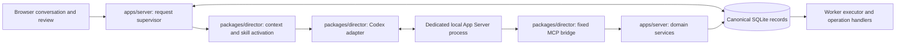

# Director runtime technical design

**Version:** 0.4 · September 10, 2026
**Status:** proposed implementation. The existing `packages/director` exports only a lifecycle placeholder; the integration described here does not exist yet.

## 1. Responsibility and ownership

The director turns conversation and current production evidence into proposed creative changes and execution plans. Codex supplies its first reasoning/tool loop. OpenSlate owns request ordering, current context, durable decisions, authorization, and recovery. A completed Codex turn is not a completed video project.



`packages/core/contracts` defines schemas shared across boundaries. `packages/director` owns the runtime interface, Codex protocol mapping, normalized events, context assembly, and MCP transport. `apps/server` owns the supervisor, repositories, request authorization, and tool handlers. The worker runs independently of the director. The runtime process and MCP bridge never write SQLite.

Use one active director turn per project. Each runtime process and MCP bridge serves one immutable authorization epoch; changing authority requires a replacement process/bridge. Read-only follow-ups and events can reuse the process without acquiring new rights. The application's logical session spans replacements. This avoids relying on native per-call request attribution or mutable shared credentials. Session closure does not stop provider monitoring.

## 2. Runtime contract

These proposed TypeScript signatures describe semantics; exported data types are derived from shared JSON Schemas. UUIDs, revisions, profiles, and activation records are imported rather than redefined here.

```ts
interface DirectorRuntime {
  readonly adapterId: string;
  probe(profile: DirectorProfile): Promise<RuntimeCompatibility>;
  open(input: OpenSession): Promise<RuntimeSession>;
  start(input: StartRequest): Promise<DispatchReceipt>;
  steer(input: SteerRequest): Promise<DispatchReceipt>;
  interrupt(input: InterruptRequest): Promise<void>;
  reply(input: PendingReply): Promise<void>;
  inspect(sessionId: Id): Promise<RuntimeSnapshot>;
  events(sessionId: Id): AsyncIterable<RuntimeEvent>;
  close(sessionId: Id): Promise<void>;
}

type DispatchReceipt =
  | { status: "accepted"; requestId: Id }
  | { status: "rejected"; code: string }
  | { status: "unknown"; requestId: Id };

type RuntimeEvent =
  | { kind: "text_delta"; requestId: Id; text: string }
  | { kind: "activity"; requestId: Id; summary: string }
  | { kind: "pending_input"; pending: RuntimePendingInput }
  | { kind: "finished"; requestId: Id;
      outcome: "completed" | "interrupted" | "failed" }
  | { kind: "connection_lost"; recoverable: boolean };
```

`OpenSession` includes the application session ID, immutable runtime/profile configuration, workspace projection, capability lock, authorization-epoch handle, and optional native resume reference. `StartRequest` binds a service-created request ID to context and skill activation IDs. `SteerRequest` must retain the expected active request and authorization epoch. Optional capabilities—steering, image input, resume, structured output, and pending-input replies—are reported by `probe`; unsupported required capabilities fail setup.

Native identifiers remain opaque persisted adapter mappings. Domain services do not import Codex thread/turn types. A different runtime can implement this contract, but must pass the same authorization and recovery tests.

## 3. Codex adapter and compatibility boundary

Use local stdio App Server with a pinned Codex binary and protocol fixtures generated from that release. The adapter performs the initialization handshake, maps session/turn requests, consumes notifications, and implements native reply round trips. Native App Server exposes thread lifecycle, turn start/steer/interrupt, and streamed item events. Keep exact method names and generated types inside this adapter. [App Server](https://learn.chatgpt.com/docs/app-server)

Avoid experimental WebSocket transport, dynamic tool registration, remote Code Mode, and experimental user-input paths in the initial dependency set. Do not infer a blanket stability promise from the existence of a method: the release fixture must verify every method/configuration actually used. If an expected feature is unavailable, fail with a compatibility error or use a separately tested reduced capability; do not silently bypass it.

Codex connects to OpenSlate's MCP server; OpenSlate does not embed the deprecated inverse `codex mcp-server` interface. Runtime tool-call notifications are useful for progress, but the corresponding application command receipt determines whether a change committed.

## 4. Durable records and state transitions

The server persists these records using the shared persistence conventions:

| Record | Required information |
|---|---|
| Director session | Project, runtime/profile/lock revisions, adapter version, native reference, status |
| Director request | Originating user/event IDs, scope, priority, context/activation IDs, dispatch state, outcome |
| Authorization epoch | Authorization-origin request/project/lock IDs, immutable allowed scope, bridge instance, credential hash, active/read-only/revoked state |
| Context snapshot | Referenced project/plan revisions, selected evidence IDs/digests, build version |
| Pending input | Request, normalized kind, allowed response shape, native correlation, resolution |
| Wakeup | Source event IDs, scope, reason, deduplication key, consumption state |

Request dispatch states are `queued → sending → active → finished`; transport loss after `sending` produces `dispatch_unknown`. Terminal outcomes distinguish completed reasoning, interruption, rejection, and failure. Process state separately tracks starting, ready, disconnected, and stopped; a disconnected process does not imply its last turn never started.

Persist `sending` before communication, then record the acknowledgment. Never hold a SQLite transaction across model/network work. On lost acknowledgment, inspect the known native session and reconcile the request using retained mappings and available evidence. Do not blindly resend `start`. If inspection cannot resolve it, revoke its authorization epoch, terminate the uncertain process, reconcile application command receipts, and create a fresh session from canonical state. Mark the original request unresolved; forced process termination does not prove that pending tool commands failed to commit. Stable domain intents must make any subsequent recovery request unable to duplicate admitted work.

## 5. Context and multi-request behavior

For each request, assemble a bounded context snapshot from the current brief, settled decisions, narration readiness, selected scope, relevant neighboring shots, active plan bindings, accepted artifacts, active jobs, and unresolved reviews. Summaries contain object IDs/revisions so `read_context` can retrieve exact details. Include full images only when the selected model supports them and they are relevant; otherwise expose usable inspection evidence or request human judgment.

The latest conversation message refines the ongoing project. It does not reset the film. Persist settled creative changes even before a runnable plan exists. Select the pinned `production` and/or `plan-authoring` skill at each request boundary; do not assume old instructions survived compaction. The [skill/tool contract](SKILLS-TOOLS.md) specifies activation provenance.

Context is a snapshot, not permission to overwrite newer state. Every mutation validates expected revisions through the server. A stale director can still produce useful prose, but its stale change cannot commit. Bound context by relevant scope and a configured budget; retrieve more through tools instead of silently truncating current decisions or approval constraints.

## 6. Input scheduling, edits, and wakeups

The supervisor serializes work with a recoverable per-project ownership lease. User input takes priority over automatic wakeups. An authority/scope-changing edit atomically persists its dispatch hold and revokes the old authorization epoch before waiting on reasoning. Interrupt and drain the old turn, or terminate its process if needed; then provision a new epoch, bridge credential, and process. Calls already committed before revocation remain recorded. Jobs already accepted by a provider continue under their recorded inputs.

V0 does not native-steer edits that change scope, authorization, or hold ownership. Steering may append information only under the unchanged epoch. Native steering requires the expected active turn and cannot change its model, workspace, sandbox, or output schema; these checks do not establish application authority. Read-only follow-up turns and events do not require process replacement. Once its authorized mutation request settles, an epoch may become read-only; it cannot regain mutation rights for another request. [Steering contract](https://learn.chatgpt.com/docs/app-server)

Interrupting from the UI atomically revokes the active epoch and persists the application's director-automation pause. Neither native completion nor a queued wakeup clears it. Resuming dispatch and reasoning are separate actions; all user holds/review gates remain effective. Each tool call retains its original transport-derived epoch through processing, and every mutation rechecks that epoch inside its commit transaction. A delayed old call can never inherit the next request's rights.

The concrete bridge is a stdio MCP child with a process-fixed opaque credential accepted by the local application. It resolves to one epoch and authorization-origin request, never a mutable current request; it is absent from model arguments. Reused read-only calls retain that epoch attribution. Replace the process when new authority needs a new credential, without assuming MCP hot reload. Native thread resume is optional and compatibility-tested; otherwise reconstruct canonical context. Resuming history must not replay tool side effects. Measure restart/resume latency and context cost as a v0 tradeoff. Later reuse across authority changes requires request-bound capabilities or proven native per-call attribution preserving the same fence. If credential isolation cannot be enforced, block integration.

Workers emit durable domain events using the shared envelope (`eventId`, `projectId`, project `sequence`, `kind`, `occurredAt`, `correlationId`, `payload`). Wakeups are derived from relevant decisions, failures requiring reasoning, or completed evidence needed for the next creative step. Coalesce repeated events for the same scope, retain their source IDs, and consume at least once with deduplication. Routine provider polling, DAG progress, and retries do not each require a model turn.

## 7. Pending questions and process isolation

Normalize native pending requests into a durable ID, category, display text, allowed response schema, and adapter correlation. The browser replies through the server, which checks the current request and allowed response. A stale response after process replacement is rejected. Native permission approval is never equivalent to keyframe approval, regeneration authorization, or budget admission. Product review decisions use their own application records and routes.

Provision a sanitized child environment with only the director's required model authentication. Keep media keys, SQLite files, application configuration secrets, and worker credentials inaccessible to native shell/file tools. Give Codex immutable skill snapshots, a read-only project projection, and bounded scratch storage. A separate runtime directory is useful state separation, but does not itself exclude inherited skill discovery or grant filesystem isolation.

Do not expose unsandboxed process/shell API routes to the product. Verify effective sandbox, network, tools, and skill configuration with adversarial fixture requests. If the pinned runtime cannot enforce the required boundary on a supported OS, block real-generation integration until an enforceable isolation mechanism exists; prompt instructions are insufficient. Native sandbox/network settings and MCP access are separate surfaces. [Configuration reference](https://learn.chatgpt.com/docs/config-file/config-reference)

## 8. Recovery, models, and acceptance tests

| Failure | Required behavior |
|---|---|
| Process exit or stream gap | Reconcile requests/receipts; recreate context; preserve jobs and holds |
| Tool timeout after commit | Return or recover the durable receipt; never replay a generation submission |
| Invalid plan/model output | Return bounded validation feedback; keep preparation uncommitted |
| Authentication failure | Pause director requests with actionable setup state; workers retain their lifecycle |
| Incompatible skill/runtime change | Preserve old lock; require successor boundary and compatibility checks |

Director profiles identify runtime, provider/model, capabilities, and credential references. Current Codex custom providers use the Responses wire protocol; arbitrary vendor APIs require compatibility proof or another runtime adapter. Record requested and provider-reported model identity when available; a pinned profile cannot freeze hosted model weights. Apply changes at turn boundaries. [Provider configuration](https://learn.chatgpt.com/docs/config-file/config-reference)

Contract tests use a fake runtime for event ordering, concurrent edits, lost acknowledgments, interrupted automation, session replacement, and pending replies. Send an old MCP call after the replacement process starts, and revoke an epoch between call validation and commit: both must fail without borrowing new authority. Pinned Codex fixtures prove process-fixed bridge credentials, explicit skills, fixed tools, resume, permitted steering, interruption, image capability, and isolation without paid media. A two-request edit preserves prior decisions/unrelated artifacts; new native call IDs cannot create another paid candidate. These fixtures gate runtime upgrades.
