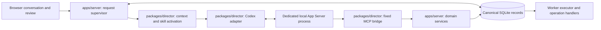

# Director runtime technical design

**Version:** 0.10 · September 12, 2026
**Status:** the durable supervisor, runtime-neutral port, pinned local Codex adapter, question continuation and browser conversation are implemented against offline fixtures. A separate NativeClient diagnostic left independent isolation inconclusive. Subsequently, the actual adapter, supervisor and input builder passed a live conversational question/restart/scoped-edit fixture; native structured pending-input and vision remain unverified. The accepted v0 policy trusts the installed pinned native runtime/sandbox on one computer; independent code-host/authentication isolation remains unverified rather than a mandatory deployment gate. The default application remains scripted while local native configuration and browser wiring are completed. See [current implementation and exact port](../implementation/CONVERSATION-WORKSPACE.md) and [implementation status](../implementation/STATUS.md).

## 1. Responsibility and ownership

The director turns conversation and current production evidence into proposed creative changes and execution plans. Codex supplies its first reasoning/tool loop. OpenSlate owns request ordering, current context, durable decisions, authorization, and recovery. A completed Codex turn is not a completed video project.

The director also proposes the next useful production stages, their scope and missing information. The [production workflow service](PRODUCTION-WORKFLOW.md) validates those proposals and derives readiness; the director cannot mark a stage satisfied or waive its requirements. Keep stage assessment in the same turn as creative work when possible, rather than requiring a routing-model call for every request.


```mermaid
flowchart LR
    UI[Browser conversation and review] --> S[apps/server: request supervisor]
    S <--> DB[(Canonical SQLite records)]
    S --> C[packages/director: context and skill activation]
    C --> A[packages/director: Codex adapter]
    A <--> P[Dedicated local App Server process]
    P --> B[packages/director: fixed MCP bridge]
    B --> D[apps/server: domain services]
    D --> DB
    DB --> W[Worker executor and operation handlers]
```

`packages/core/contracts` defines schemas shared across boundaries. `packages/director` owns the runtime interface, Codex protocol mapping, normalized events, context assembly, and MCP transport. `apps/server` owns the supervisor, repositories, request authorization, and tool handlers. The worker runs independently of the director on the same computer. The runtime and MCP bridge have no application role that writes SQLite; project changes go through the server. V0 runs the UI, service, database, media, workers and native runtime on one machine. It does not support multi-host applications, remote GPU workers, distributed scheduling or shared-database deployment. The local native process may call a configured cloud LLM, and local media adapters may call cloud providers; local deployment is not offline generation.

Use one active director turn per project on this machine. Local supervisor/worker ownership leases still protect against overlapping processes and crashes. Each runtime process and MCP bridge serves one immutable authorization epoch; changing authority requires a replacement process/bridge. Read-only follow-ups and events can reuse the process without acquiring new rights. The application's logical session spans replacements. This avoids relying on native per-call request attribution or mutable shared credentials. Session closure does not stop provider monitoring.

## 2. Runtime contract

These proposed TypeScript signatures describe the broader target, not the current exported interface. The current port is deliberately smaller: `DirectorRuntime.start(input, { signal, onEvent })`, with application-owned queuing, question replies and interruption. See `packages/director/src/runtime/types.ts`. Each dispatched application request reconstructs context and starts a fresh native thread/process; optional native resume exists only at the adapter/fixture boundary. The following session-oriented expansion remains proposed.

```ts
interface DirectorRuntime {
  readonly adapterId: string;
  probe(profile: DirectorProfile): Promise<RuntimeCompatibility>;
  open(input: OpenSession): Promise<RuntimeSession>;
  start(input: StartRequest): Promise<DispatchReceipt>;
  steer(input: SteerRequest): Promise<DispatchReceipt>;
  interrupt(input: InterruptRequest): Promise<void>;
  reply(input: PendingReply): Promise<void>;
  inspect(sessionId: Id): Promise<RuntimeSnapshot>;
  events(sessionId: Id): AsyncIterable<RuntimeEvent>;
  close(sessionId: Id): Promise<void>;
}

type DispatchReceipt =
  | { status: "accepted"; requestId: Id }
  | { status: "rejected"; code: string }
  | { status: "unknown"; requestId: Id };

type RuntimeEvent =
  | { kind: "text_delta"; requestId: Id; text: string }
  | { kind: "activity"; requestId: Id; summary: string }
  | { kind: "pending_input"; pending: RuntimePendingInput }
  | { kind: "finished"; requestId: Id;
      outcome: "completed" | "interrupted" | "failed" }
  | { kind: "connection_lost"; recoverable: boolean };
```

`OpenSession` includes the application session ID, immutable runtime/profile configuration, workspace projection, capability lock, authorization-epoch handle, and optional native resume reference. `StartRequest` binds a service-created request ID to context and skill activation IDs. `SteerRequest` must retain the expected active request and authorization epoch. Optional capabilities—steering, image input, resume, structured output, and pending-input replies—are reported by `probe`; unsupported required capabilities fail setup.

Native identifiers remain opaque persisted adapter mappings. Domain services do not import Codex thread/turn types. A different runtime can implement this contract, but must pass the same authorization and recovery tests.

## 3. Codex adapter and compatibility boundary

Use same-machine stdio App Server with a pinned Codex binary and protocol fixtures generated from that release. V0 has one native policy mode, `local`, bound to exact version/configuration identity; trust the installed runtime/sandbox under the [accepted decision](../implementation/RUNTIME-TRUST-DECISION.md). The typed-tool endpoint is loopback-only. The adapter performs the initialization handshake, maps session/turn requests, consumes notifications, and implements native reply round trips. Native App Server exposes thread lifecycle, turn start/steer/interrupt, and streamed item events. Keep exact method names and generated types inside this adapter. [App Server](https://learn.chatgpt.com/docs/app-server)

Avoid experimental WebSocket transport, dynamic tool registration, remote Code Mode, and experimental user-input paths in the initial dependency set. Do not infer a blanket stability promise from the existence of a method: the release fixture must verify every method/configuration actually used. If an expected feature is unavailable, fail with a compatibility error or use a separately tested reduced capability; do not silently bypass it.

Codex connects to OpenSlate's MCP server; OpenSlate does not embed the deprecated inverse `codex mcp-server` interface. Runtime tool-call notifications are useful for progress, but the corresponding application command receipt determines whether a change committed.

The [MCP follow-up](../implementation/CODEX-MCP-FOLLOWUP.md) verified the planned stdio transport on Codex 0.153.4 with the native tool host enabled. Native approval policy also required explicit per-tool approval for the harmless synthetic handlers; application authorization remains independently enforced. The earlier dynamic-tool experiment remains diagnostic evidence only. Verify the effective tool/skill catalog after configuration overrides; empty table overrides and discovery flags alone did not remove inherited entries in the inspected runtime.

In the tested explicit legacy history mode, native history APIs omitted tool output even though the saved session log retained it. Persist invocation identities and results in OpenSlate and reconstruct context from application records; do not make recovery or the UI depend on native history returning every tool result. Private native session-log parsing is diagnostic evidence, not a supported production dependency. The follow-up verified a real model turn after replacement with application-supplied prior receipts and current context. Native recall without that reconstruction remains unverified. A [later application-backed validation](../implementation/CODEX-SKILL-VALIDATION.md) accepted the exact native skill inputs on two scoped edits, while OpenSlate supplied and recorded their focused references. The actual supervisor later passed a conversational question and scoped edit across backend restart using the same SQLite records, a reused skill lock and fresh activation/epoch. The old bridge returned 403. This used ordinary conversation; native structured pending-input replies and vision still need live verification. See [supervisor evidence](../implementation/CODEX-SUPERVISOR-VALIDATION.md). Independent code-host/authentication isolation remains unverified under the accepted local trust policy; it is not an additional v0 deployment prerequisite.

## 4. Durable records and state transitions

The server persists these records using the shared persistence conventions:

| Record | Required information |
|---|---|
| Director session | Project, runtime/profile/lock revisions, adapter version, native reference, status |
| Director request | Originating user/event IDs, scope, priority, context/activation IDs, dispatch state, outcome |
| Authorization epoch | Authorization-origin request/project/lock IDs, immutable allowed scope, bridge instance, credential hash, active/read-only/revoked state |
| Context snapshot | Referenced project/plan revisions, selected evidence IDs/digests, build version |
| Workflow binding | Service-owned stage run/proposal IDs, consumed input revisions, stage versions, locked recipe and task prompt identities |
| Pending input | Request, normalized kind, allowed response shape, native correlation, resolution |
| Wakeup | Source event IDs, scope, reason, deduplication key, consumption state |

Request dispatch states are `queued → sending → active → finished`; transport loss after `sending` produces `dispatch_unknown`. Terminal outcomes distinguish completed reasoning, interruption, rejection, and failure. Process state separately tracks starting, ready, disconnected, and stopped; a disconnected process does not imply its last turn never started.

Persist `sending` before communication, then record the acknowledgment. Never hold a SQLite transaction across model/network work. On lost acknowledgment, inspect the known native session and reconcile the request using retained mappings and available evidence. Do not blindly resend `start`. If inspection cannot resolve it, revoke its authorization epoch, terminate the uncertain process, reconcile application command receipts, and create a fresh session from canonical state. Mark the original request unresolved; forced process termination does not prove that pending tool commands failed to commit. Stable domain intents must make any subsequent recovery request unable to duplicate admitted work.

## 5. Context and multi-request behavior

For each request, assemble a bounded context snapshot from the current brief, settled decisions, narration readiness, selected scope, relevant neighboring shots, active plan bindings, accepted artifacts, active jobs, and unresolved reviews. Summaries contain object IDs/revisions so `read_context` can retrieve exact details. Include full images only when the selected model supports them and they are relevant; otherwise expose usable inspection evidence or request human judgment.

Include the locked recipe's suggested methods, scope-specific stage readiness, registered missing requirements and relevant task prompts. Separate AI-observed creative concerns from service-verified blockers. The director may choose among supported tasks, draft provisional work, ask for missing context or propose a different valid path. It does not need to traverse completed stages or follow a single project-wide stage number. Several logical stages may be addressed in one bounded output batch; v0 still has one active director turn per project.

The latest conversation message refines the ongoing project. It does not reset the film. Persist settled creative changes even before a runnable plan exists. Select the pinned `production` and/or `plan-authoring` skill at each request boundary; do not assume old instructions survived compaction. The [skill/tool contract](SKILLS-TOOLS.md) specifies activation provenance.

Context is a snapshot, not permission to overwrite newer state. Every mutation validates expected revisions through the server. A stale director can still produce useful prose, but its stale change cannot commit. Bound context by relevant scope and a configured budget; retrieve more through tools instead of silently truncating current decisions or approval constraints.

## 6. Input scheduling, edits, and wakeups

The supervisor serializes work with a recoverable per-project ownership lease among local processes. No distributed coordinator or cross-host lease service is part of v0. User input takes priority over automatic wakeups. An authority/scope-changing edit atomically persists its dispatch hold and revokes the old authorization epoch before waiting on reasoning. Interrupt and drain the old turn, or terminate its process if needed; then provision a new epoch, bridge credential, and process. Calls already committed before revocation remain recorded. Jobs already accepted by a provider continue under their recorded inputs.

V0 does not native-steer edits that change scope, authorization, or hold ownership. Steering may append information only under the unchanged epoch. Native steering requires the expected active turn and cannot change its model, workspace, sandbox, or output schema; these checks do not establish application authority. Read-only follow-up turns and events do not require process replacement. Once its authorized mutation request settles, an epoch may become read-only; it cannot regain mutation rights for another request. [Steering contract](https://learn.chatgpt.com/docs/app-server)

Interrupting from the UI atomically revokes the active epoch and persists the application's director-automation pause. Neither native completion nor a queued wakeup clears it. Resuming dispatch and reasoning are separate actions; all user holds/review gates remain effective. Each tool call retains its original transport-derived epoch through processing, and every mutation rechecks that epoch inside its commit transaction. A delayed old call can never inherit the next request's rights.

The concrete bridge is a stdio MCP child with a process-fixed opaque credential accepted by the local application. It resolves to one epoch and authorization-origin request, never a mutable current request; it is absent from model arguments. Reused read-only calls retain that epoch attribution. Replace the process when new authority needs a new credential, without assuming MCP hot reload. Native thread resume is optional and compatibility-tested; otherwise reconstruct canonical context. Resuming history must not replay tool side effects. Measure restart/resume latency and context cost as a v0 tradeoff. Later reuse across authority changes requires request-bound capabilities or proven native per-call attribution preserving the same fence. These application fences remain required under the local runtime trust policy; they are not an independent proof of native credential isolation.

Workers emit durable domain events using the shared envelope (`eventId`, `projectId`, project `sequence`, `kind`, `occurredAt`, `correlationId`, `payload`). Wakeups are derived from relevant decisions, failures requiring reasoning, or completed evidence needed for the next creative step. Coalesce repeated events for the same scope, retain their source IDs, and consume at least once with deduplication. Routine provider polling, DAG progress, and retries do not each require a model turn.

The workflow service reconciles stage evidence before deciding whether a wakeup needs reasoning. Pending application questions and stage outputs survive process replacement. A stage transition within the same authorized request does not itself change the authorization epoch; each output still needs a valid prepared-change/stage binding and current input versions. Reassessments without new evidence or changed valid output are bounded and eventually wait for input rather than running indefinitely.

## 7. Pending questions and accepted local runtime trust

Normalize native pending requests into a durable ID, category, display text, allowed response schema, and adapter correlation. The browser replies through the server, which checks the current request and allowed response. A stale response after process replacement is rejected. Native permission approval is never equivalent to keyframe approval, regeneration authorization, or budget admission. Product review decisions use their own application records and routes.

Provision a sanitized child environment with only the director's required model authentication and launch inputs. Configure native command permissions to deny media keys, SQLite files, application configuration secrets and worker credentials. Give Codex immutable skill snapshots, a read-only project projection and bounded scratch storage. Exact catalog/configuration checks remain required. V0 trusts the pinned runtime to enforce its configured sandbox; these settings and separate directories do not establish independent code-host or authentication isolation.

Do not expose unsandboxed process/shell API routes to the product. Require the application-selected policy below, then verify effective permission values, exact MCP tools and selected skills before starting a model turn. An observed configuration/catalog mismatch still fails setup. V0 does not require a separate independent-confinement assertion or offer an externally confined mode; native sandbox/network configuration and OpenSlate MCP authorization remain separate surfaces. [Configuration reference](https://learn.chatgpt.com/docs/config-file/config-reference)

```ts
interface LocalCodexPolicy {
  mode: "local";
  id: string;
  runtimeVersion: string;
  config: Readonly<Record<string, CodexConfigValue>>;
}
```

This is the implemented policy shape from `packages/director/src/runtime/policy.ts`. It selects an exact local runtime/configuration, not a proof of confinement. Other modes are rejected. The actual supervisor/native backend fixture has now passed, separately from accepting the policy. Keep the default application scripted while local configuration/browser setup is wired and verified.

The pinned runtime supports named permission profiles through experimental `permissions` selectors on thread start/resume and turn start, plus `permissionProfile` on `command/exec`. Do not combine these with legacy `sandbox`/`sandboxPolicy` selectors. Require the profile to be allowed and active, then exercise both positive and negative canaries. Keep filesystem path keys inside one structured permissions TOML value; dotted CLI overrides misparsed quoted paths in the tested binary. Treat configuration serialization and effective-profile verification as adapter compatibility tests.

Observed boundaries are distinct: command sandbox canaries passed, but a live model declined the code-host canary script before execution. The first creative turn used four generic `exec` calls even with `features.code_mode=false`; that flag does not establish an absent execution surface. The app-server is trusted authentication-bearing code. The accepted local decision relies on the installed runtime/sandbox; it does not claim that model-generated code cannot inspect authentication files or environment under every native execution surface. A refusal or lack of observed traffic cannot substitute for independent enforcement evidence. Keep authentication out of model context and audit output, preserve process-fixed bridge credentials and epoch revocation, and record the unverified boundary honestly.

For context efficiency, supply a fresh application snapshot and only required verified references, retain a stable instruction prefix where practical, and refresh missing or stale sections. Avoid routinely supplying the entire source and then requiring it to be read again. Prepare/apply version and scope checks remain mandatory. The two-shot live fixture measured approximately 24/30 seconds per edit; these results do not establish production performance.

## 8. Recovery, models, and acceptance tests

| Failure | Required behavior |
|---|---|
| Process exit or stream gap | Reconcile requests/receipts; recreate context; preserve jobs and holds |
| Tool timeout after commit | Return or recover the durable receipt; never replay a generation submission |
| Invalid plan/model output | Return bounded validation feedback; keep preparation uncommitted |
| Authentication failure | Pause director requests with actionable setup state; workers retain their lifecycle |
| Incompatible skill/runtime change | Preserve old lock; require successor boundary and compatibility checks |

Director profiles identify runtime, provider/model, capabilities, and credential references. Current Codex custom providers use the Responses wire protocol; arbitrary vendor APIs require compatibility proof or another runtime adapter. Record requested and provider-reported model identity when available; a pinned profile cannot freeze hosted model weights. Apply changes at turn boundaries. [Provider configuration](https://learn.chatgpt.com/docs/config-file/config-reference)

Contract tests use a fake runtime for event ordering, concurrent edits, lost acknowledgments, interrupted automation, session replacement, and pending replies. Send an old MCP call after the replacement process starts, and revoke an epoch between call validation and commit: both must fail without borrowing new authority. Pinned Codex fixtures verify the local policy/version/configuration, loopback-only bridge, exact catalogs, explicit skills, bounded lifecycle and application epoch behavior. The live fixture has verified actual supervisor conversational question/restart/scoped-edit behavior with no media dispatch. Native structured pending-input and optional resume/steering/image capabilities need their own evidence. These fixtures do not prove independent host or authentication isolation and require no paid media. A two-request edit preserves prior decisions/unrelated artifacts; new native call IDs cannot create another paid candidate. These fixtures gate runtime upgrades.
