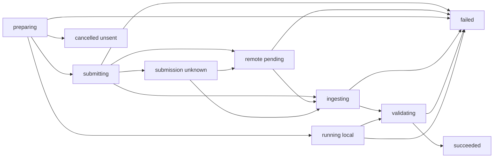

# OpenSlate — Durable Execution Engine

**Version:** 0.4 · September 10, 2026
**Status:** implementation specification; proposed contracts, not implemented behavior.
**Ownership:** local TypeScript worker plus shared executor/policy repositories. The server owns creative mutations; the worker owns execution progress. See [Plan Compiler](PLAN-COMPILER.md) and the [confirmed execution rules](../design/EXECUTION-AND-EDITING.md).

## 1. Process and storage boundary

The server and separately supervised local worker share one SQLite database through `better-sqlite3`, WAL, foreign keys, and short transactions. Mutating claims/admission use `BEGIN IMMEDIATE`; no transaction contains `await`, provider traffic, file transfer, FFmpeg, or model reasoning. Configure bounded busy handling and retry contention outside transactions. Domain checks are shared code, not duplicated browser/worker interpretations.

The worker executes six registered operation families and their transfer/validation phases. A remote Python GPU worker later receives versioned requests and artifacts through an adapter; it never opens OpenSlate's database. Codex sessions are not job storage. Browser disconnection and director interruption do not stop monitoring accepted work while the application worker remains running.

All identities are opaque UUIDs. Persist domain events using the shared envelope: `eventId`, `projectId`, project `sequence`, `kind`, `occurredAt`, `correlationId`, and `payload`. Insert the event in the same transaction as the change; UI delivery and director wakeups may be retried independently.

## 2. Execution records and states

Separate a node's current eligibility from a concrete attempt's external lifecycle:

```ts
type NodeState = 'waiting' | 'ready' | 'active'
  | 'succeeded' | 'blocked' | 'retired';
type AttemptPhase = 'preparing' | 'submitting' | 'remote_pending'
  | 'submission_unknown' | 'ingesting' | 'running_local'
  | 'validating' | 'succeeded' | 'failed' | 'cancelled_unsent';

interface Attempt {
  attemptId: AttemptId;
  generationIntentId?: GenerationIntentId;
  candidateId?: CandidateId;
  ordinal: number;
  nodeId: NodeId;
  specRevisionId: NodeSpecRevisionId;
  phase: AttemptPhase;
  executionFingerprint?: string;
  receipt?: ProviderReceipt;
  nextActionAt?: string;
  leaseOwner?: WorkerId;
  leaseEpoch: number;
  leaseExpiresAt?: string;
  reservationId?: ReservationId;
}
```

Enforce uniqueness of `(candidateId, ordinal)` for generation attempts and of service-issued work keys for other operations. Preparation retries stay in the same attempt; another externally submitted attempt receives a new ordinal. Phase retry counters, terminal failure evidence, capability identity, and cancellation/control references supplement this abbreviated record.



Each failure retains its phase and trusted classification. Ingestion failure after provider success is not evidence that generation failed. Unknown submissions may be operationally closed by a recorded human disposition; their ledger liability remains. A new paid attempt is a separate record, never a reset of the original phase.

## 3. Readiness and dispatch algorithm

The ready queue is a rebuildable scheduling index. It is not permission to execute. Workers scan persisted due work on startup and use completion events to reduce delay afterward.

1. Find nodes with resolved required output/artifact bindings, relevant accepted narration cues, and satisfied gates. Other branches remain independent. Begin with FIFO plus fairness across scenes; add measured critical-path priorities later.
2. Claim preparation in a short transaction, checking active node/spec binding and all applicable holds. Allocate or reuse the attempt and increment its lease epoch. Preparation includes final input resolution and approved conditioning-byte verification.
3. Outside the transaction, materialize transfers, validate provider parameters, and obtain a versioned quote from configured pricing/capability data. There are no paid generation calls in preparation.
4. In a new admission transaction, recheck current node/spec/candidate binding, lease ownership, prompt provenance, human approval digest, narration/timing readiness, candidate origin, controls, retry allowance, quote validity, budget, and capacity. Create the reservation, persist immutable submission parameters/fingerprint, and mark `submitting` before sending bytes.
5. Call the pinned handler outside the transaction. Persist its outcome, schedule the next phase, and release only capacity whose real work has ended.

A hold committed before submission intent prevents dispatch. After that intent commits, work is potentially sent even if an edit immediately follows. This is the explicit race boundary; an edit cannot roll back an external side effect.

The human-review equality check covers actual final conditioning bytes and effective shot/video settings. An approved frame plus available budget cannot authorize arbitrary candidates. Each candidate must reference its uniquely consumed, service-issued immutable `grantSlotId`, bound to the authorized purpose/scope. Consumption uniqueness does not include logical node ID, so renaming a node cannot create another candidate. Initial slots or human-scoped creative additions supply those grants. Technical retries retain the candidate and require trusted failure evidence plus retry allowance. Agent labels are not evidence.

Validate cue readiness/provenance independently of actual generation inputs. Video fingerprints include only consumed narration meaning/relative timing and media actually sent to the provider; a new cue ID or narration waveform does not inherently change a visual generation request. Exact audio bytes and absolute ranges do affect render identity. A committed compatibility binding may retain the original attempt across a cue/spec revision after validated equivalence; never rewrite the attempt's original provenance.

## 4. Provider outcomes and local completion

Import `SubmitResult` from the [providers contract](PROVIDERS-ARTIFACTS.md); do not maintain an engine-specific competing union. Its four outcomes are:

| Result | Meaning |
|---|---|
| `accepted` | Provider receipt identifies asynchronous work |
| `completed` | Receipt plus output descriptors; ingestion still required |
| `rejected` | Explicit `not_accepted` certainty and normalized `ProviderError` |
| `unknown` | Diagnostic without conclusive acceptance/rejection evidence |

A synchronous receipt may contain a request ID without a remote task ID. Trusted execution code classifies provider errors into persisted `TrustedFailure` evidence and grants `RetryAuthority` only for eligible outcomes. Provider error text is data; it does not authorize a creative change.

Accepted asynchronous work enters `remote_pending`; synchronous image/speech output enters ingestion. Definite non-acceptance may release the reservation if no charge remains, while a possibly transmitted request enters `submission_unknown`. Unknown network exceptions must not default to definite rejection. Disable unproven SDK/HTTP automatic retries of create requests. An operation ID sent to a provider is not proof that the provider implements idempotency.

Poll known receipts with backoff and jitter. Do not hold a local execution slot while waiting for a future poll; persist `nextActionAt`. Provider concurrency permits represent outstanding remote jobs, while upload/download and FFmpeg permits represent local active work. Release remote capacity at known remote termination, not after a potentially lengthy download.

Outputs are written to attempt/lease-specific scratch storage and ingested through an artifact manifest. Validate file type, decoding, streams, dimensions, and actual duration as appropriate. Only durable, validated artifact metadata can satisfy a dependent input. Retry retrieval or supported URL refresh before proposing any new generation.

Publication of files and SQLite metadata is recoverable, not one cross-filesystem transaction. The ingestion service records manifests/checksums and publishes immutable blobs atomically; reconciliation completes metadata after a crash. A local render similarly uses a frozen manifest, temporary output, verification, and atomic publication under the [render contract](TIMELINE-RENDERING.md). No model-written shell command is an execution recipe.

## 5. Financial admission and retry accounting

Represent money as integer micros plus currency. Use `bigint` internally, decimal strings in JSON, and SQLite integer-safe reads/writes within the supported signed range. Never sum floating-point prices or implicitly convert currencies.

```ts
interface AdmissionQuote {
  currency: string;
  estimatedMicros: bigint;
  maximumMicros?: bigint;
  sourceRevision: string;
  validUntil?: string;
  enforceableMaximum: boolean;
}
```

A strict monetary admission cap requires a trustworthy enforceable upper bound. When unavailable, use an explicitly accepted unit/job allowance and show estimates; do not call that an invoice cap. Also bound generated seconds, attempts, parallel work, and local compute. Director usage is separately accounted for and is not media-provider credit.

The admission transaction atomically checks existing recognized charges, unresolved liabilities, and active reservations against the applicable allowance, then adds one reservation per attempt. Prepared plans hold estimates only. Two competing workers cannot both spend the same remaining allowance. Cap reductions prevent further admission; they do not cancel prior liabilities.

Ledger transitions move amounts between reservation, unsettled liability, and recognized estimated/reported charge without double counting. Use unique accounting-event keys. Unknown submissions retain their potential cost. Successful remote work can be chargeable even when ingestion fails. Technical failure can also be charged; retrying therefore receives a new reservation while preserving the previous charge. Cancellation is not a refund signal.

If actual usage is unavailable, book the conservative amount as estimated rather than zero. Reconciliation adjusts it with evidence and retains history. Provider invoices, stale rate data, and undisclosed charges cannot be perfectly controlled by application estimates; surface uncertainty and halt new admission when reported liability exceeds the allowance.

## 6. Leases, evidence, and restart recovery

Use a 30-second preparation/local-work lease with approximately 10-second heartbeats initially; make these operational settings, not provider timeouts. Due monitoring jobs claim short leases around their actions. Every canonical progress commit compares owner and monotonically increasing lease epoch. Losing a lease forbids further progress mutations, but cannot undo an already transmitted request.

An expired `preparing` lease can be reclaimed safely because create submission has not been authorized. Expired `submitting` without a persisted outcome is unknown, never automatically resubmitted. A known receipt resumes monitoring. Lease takeover during ingestion resumes its manifest. A local process supervisor checks an owned FFmpeg process before restarting it; scratch/output isolation prevents an old process from publishing over its successor.

Permit a trusted stale submitter to append immutable outcome evidence tied to the original attempt and request fingerprint. This includes a late receipt or durable synchronous output manifest. The current reconciler validates it and alone advances state. Conflicting receipts remain an explicit problem; evidence append does not bypass fencing, authorize a new call, or alter ledger totals by itself.

On startup and periodically, reconcile expired leases, overdue polls, unfinished manifests, undelivered events, and unresolved submissions. Never infer “not accepted” merely from an empty provider list, an expired history window, or a missing local receipt. Retain uncertain liabilities until evidence or an explicit operational disposition exists. Worker downtime and machine sleep pause local work while cloud jobs may continue.

## 7. Retry and control policy

| Failure/control | Engine action |
|---|---|
| Transient preparation/poll/download error | Retry that phase with bounded backoff |
| Definitely rejected transient create | New recorded attempt within trusted retry/budget policy |
| Definitive technical generation failure | Next attempt, same approved creative setup, fresh reservation |
| Invalid input or provider policy refusal | Block for a decision; no automatic prompt rewrite |
| Unknown create outcome | Reconcile; no blind retry |
| Technically valid but unattractive result | Present to user; no automatic candidate |
| Pause dispatch or scoped edit hold | Block new submission; continue accepted-job monitoring |
| Interrupt director | Persist automation pause; do not cancel jobs |

Use a small initial retry limit, such as three transient phase retries and one additional paid technical attempt, exposed as explicit policy. Provider-specific retryability is allowlisted; unknown failures require attention. A human replacement of unknown work creates a distinct candidate/intention linked to the unresolved original, with a new allowance.

H3 remote cancellation remains unsupported in v0 because its delete endpoint can delete a newly completed task after a cancellation race. Pre-submission work can be cancelled locally. Later adapters may support safe remote cancellation; request and confirmed outcome are separate records, and billing remains independently reconciled.

## 8. Output binding, events, and tests

Workers commit immutable outputs and guarded execution-node bindings, not creative selected-take or current-preview pointers. They append completion events. The server projects eligible outputs into draft selections or preview heads only after checking the current candidate/specification and render target. Old outputs remain historical. Completion during an unrelated edit can still attach; completion for a replaced candidate cannot overwrite current intent.

Deliver events at least once. Consumers deduplicate by event identity/sequence; director wakeups coalesce decision-worthy results and respect automation pause. A wakeup never itself grants candidate authority. Replayed tools with fresh call IDs still encounter the service-owned intent/attempt uniqueness checks.

Required integration tests use real SQLite connections and a fault-injectable fake provider:

- Competing near-cap admissions commit only covered reservations.
- A hold races with submission intent at both sides of the transaction boundary.
- Provider acceptance followed by connection loss remains unknown without duplicate create.
- A late stale-worker receipt or synchronous output manifest is recovered under the current lease.
- Every crash point between file publication and metadata commit recovers without a missing “ready” artifact.
- Technical retry preserves approval and charged history; a new creative take without human origin is rejected.
- Changed narration/profile/keyframe invalidates affected dispatch while unrelated branches advance.
- Restart, duplicate events, and replayed requests preserve work identities and current preview selection.

Instrument queue wait, phase latency, lease takeovers, unknown submissions, retries by cause, reservations/liabilities, and output-binding conflicts. Live provider tests validate actual contracts separately; synthetic crash tests cannot establish undocumented provider idempotency or cancellation guarantees.
