# Narration and timed story development

**Version:** 0.4 · September 10, 2026
**Status:** detailed design; contracts below are proposed, not implemented.

## Responsibility and boundaries

The narration component turns uploaded recordings, notes, partial scripts, or an empty brief into an accepted sequence of timed speech segments. It supplies versioned meaning and timing to shot planning. It does not write directly to provider APIs from a director turn, infer human acceptance from successful synthesis, or silently rewrite supplied text.

The director proposes prose and asks useful questions. Application services preserve accepted choices; trusted operations perform import, synthesis, transcription, and timing. All paid operations use the admission and recovery rules in [Execution engine](EXECUTION-ENGINE.md). Audio bytes follow [artifact storage](PROVIDERS-ARTIFACTS.md); their editorial placement follows [timeline design](TIMELINE-RENDERING.md).

```mermaid
flowchart LR
    Input[Recording script or notes] --> Import[Import and inventory]
    Import --> State[Readiness and gaps]
    State --> Director[Conversational proposals]
    Director --> Revision[Accepted script and source choices]
    Revision --> Speech[Speech operation when required]
    Import --> Audio[Immutable uploaded audio]
    Speech --> Audio
    Audio --> Timing[Probe transcribe and map segments]
    Revision --> Timing
    Timing --> Review[Audio and uncertain cue review]
    Review --> Cues[Accepted cue revision]
    Cues --> Shots[Shot timing and timeline]
```



## Domain records and contracts

Use UUIDs for stable identities and separate immutable revision IDs. Readiness is a projection from records, not an agent-authored assertion that work is complete.

```ts
type NarrationSource =
  | { kind: "undecided" }
  | { kind: "uploaded"; artifactId: ArtifactId; range?: SampleRange }
  | { kind: "synthesized"; profileRevisionId?: ProfileRevisionId;
      voice?: string }; // unresolved choices block synthesis

interface NarrationReadiness {
  text: "none" | "notes" | "outline" | "draft" | "approved";
  audio: "none" | "partial" | "complete" | "accepted";
  timing: "absent" | "estimated" | "measured" | "accepted";
  gaps: NarrationGap[];
}

interface ScriptSegmentRevision {
  id: ScriptSegmentRevisionId;
  segmentId: NarrationSegmentId;
  text: string;
  language: string;
  purpose: string;
  factRefs: string[];
  sourceDecisionIds: DecisionId[];
  source: NarrationSource;
}

interface CueRevision {
  id: CueRevisionId;
  segmentRevisionId: ScriptSegmentRevisionId;
  audioArtifactId: ArtifactId; // normalized waveform actually measured
  sampleRate: 48000;
  startSample: number;        // inclusive; local to audioArtifactId
  endSample: number;          // exclusive; safe integer
  method: "provider_timestamps" | "mapped_transcript" | "human";
  transcriptRevisionId?: TranscriptRevisionId;
  confidence: number | null; // do not invent a provider confidence
  mappingStatus: "matched" | "needs_review";
}
```

`NarrationGap` has a stable key, category, scope, suggested options, and blocking stage: `writing`, `synthesis`, `timing`, or `export`. Example categories are missing CTA, unknown pronunciation, missing source segment, and audio/script mismatch. A gap only closes against an explicit decision or verified operation output. Dismissing a nonessential gap is also a recorded decision. Uploaded-source ranges refer to the normalized working waveform; original-file identity and conversion mapping remain in artifact provenance.

Persist script collections and ordered segment membership in immutable narration revisions. Persist audio candidates, transcript revisions, synthesis-chunk membership, cue revisions, and human acceptance decisions separately. Shared revision storage may hold typed JSON bodies; foreign-key relation rows link actual audio artifacts and segment revisions. Provider work uses common intent/attempt/receipt records. No audio payload belongs in SQLite. Accepted narration binds exact script, source audio, cue-set, and mix choices, allowing an uploaded recording with an approved transcript to be a complete narration source.

## Conversational gap-closing algorithm

1. Inventory attachments and current accepted decisions. Probe audio immediately using a local job; detect supplied text and link claimed product facts to their sources.
2. Classify text, audio, and timing independently. A finished recording without a written script is not “no narration”; a polished script without audio is not complete audio.
3. Compute the smallest blocking gap for the current task. Offer two or three concrete options when options help: keep the existing recording and write its missing ending, generate only missing passages, or replace it with a new narration.
4. Persist the chosen direction and edits through the change service even before a production graph exists. A choice of tone alone does not authorize synthesis spending.
5. Draft only requested or missing sections. Return a concise scene/script summary with expandable exact text. Resolve required voice, language, source, and pronunciation choices before synthesis.
6. Recompute gaps after each decision. New requests read this projection instead of restarting the interview. A scope change invalidates affected acceptance, not unrelated script segments.

The scene/shot planner can work from estimated narration while text develops. It records estimates as provisional. Video admission for an affected shot requires settled generation duration and approved inputs; a timing estimate must not masquerade as measured audio.

## Uploaded and generated audio pipeline

**Upload path.** Preserve the original bytes, then produce a 48 kHz normalized PCM working artifact with recorded transform provenance. Probe channel layout, sample count, duration, decode validity, and waveform summary. Preserve deliberate silence; trimming, denoising, and tempo changes are editorial choices. If the user supplied a transcript, compare it to recognized speech rather than overwriting it. Otherwise transcription creates a draft transcript for acceptance. Incorrect recognition is a text/timing decision, not a reason to regenerate uploaded audio.

**Generated path.** A synthesis request binds script revisions, exact text, voice, language, delivery instructions, provider profile, and pronunciation choices. The first adapter is proposed as OpenAI Speech with a configured `gpt-4o-mini-tts` profile. The Speech API supplies waveform generation and configurable voices/instructions; account access and the selected settings still require an integration probe. Generated voice is identified as such in review and export provenance. [Official speech guide](https://developers.openai.com/api/docs/guides/text-to-speech)

Logical segments do not require one API call per sentence. Pack adjacent compatible segments into synthesis chunks, respecting both the selected profile's character and token limits; cut at sentence/paragraph boundaries and preserve an ordered membership map. The documented Speech request limit and model token limit are distinct, so validate both rather than assuming a six-minute script fits one call. [Speech request reference](https://developers.openai.com/api/reference/cli/resources/audio/subresources/speech/methods/create), [TTS model](https://developers.openai.com/api/docs/models/gpt-4o-mini-tts)

All chunks retain one immutable voice/settings profile. Independent chunks may execute concurrently, but success does not guarantee identical prosody across boundaries. Present the assembled result; do not purchase replacements to improve its sound without a user request. Editing one segment can require resynthesizing its containing chunk; the impact summary reports that true unit of replacement. Segment boundaries are stable even when audio-chunk boundaries change.

**Timing path.** Prefer verified provider timestamps when supported. The initial transcription adapter is OpenAI Audio, with a timing-capable profile explicitly selected: the current guide limits `timestamp_granularities` to `whisper-1`; do not assume a GPT transcription profile provides word timestamps. If unavailable for the account, require another tested timing adapter or explicit human segment boundaries. [Official transcription guide](https://developers.openai.com/api/docs/guides/speech-to-text)

For generated audio, normalize script and transcript tokens without deleting product names; use monotone sequence alignment to map recognized words to script segments. Map matched timestamp boundaries into sample coordinates local to the normalized waveform identified by `audioArtifactId`, and flag omissions/repetitions or ambiguous mappings. Never add assembled-narration or timeline chunk offsets to these source ranges. Chunk placement belongs in the separate timeline `AudioPlacement.atSample` mapping. If chunks are physically concatenated into a new waveform artifact, create successor cues explicitly bound to that new artifact with its corresponding source coordinates. This is transcript matching, not a promise of acoustic forced alignment. Never estimate timestamps from character proportions and label them measured. Simple sentence-level cues are sufficient initially; karaoke highlighting is deferred.

## Timing changes and reuse

Convert provider decimal timestamps to artifact-local sample indices once, with a recorded rounding rule; require ordered ranges within that artifact's actual decoded sample count. Project frame placement derives from rational conversion of the resolved timeline sample position: placement offset plus the cue's offset within the selected source range. At 30 fps and 48 kHz, one frame is 1,600 samples. Future fractional rates use integer rational arithmetic, not repeated floating-point additions.

Compare successor cue sets by stable segment identity. Distinguish:

| Change | Consequence |
|---|---|
| Same meaning and duration, later timeline position | Reuse existing visual takes; replace placement/captions |
| Changed wording with the same visual meaning | Update narration and cue mappings; director confirms whether shot intent changes |
| Changed shot duration or meaning | Revise affected shot specification, compile impact, and refresh affected storyboard approval |
| New voice across all segments | Regenerate authorized audio, remeasure all cues; do not automatically regenerate visuals |
| Provider returns omitted/mismatched words | Preserve candidate and report mismatch; request a choice rather than aesthetic retry |

Keep the exact cue/audio revision in provenance and readiness checks, but compute a video's execution and approval digests from the narration properties its generation actually consumes: visual meaning and relative timing constraints. A changed containing waveform hash, cue ID, or absolute placement alone must not invalidate that video's media fingerprint. Validate and persist the semantic/timing rebind; do not drop the dependency. If a future video operation actually consumes audio conditioning, its exact conditioning audio hash belongs in that operation's fingerprint and review. Timeline/render manifests always retain the exact audio hashes and ranges they play.

If measured audio exceeds 360 seconds, show options to shorten text, revise pauses/pace, or shorten the selected audio range. The service rejects a six-minute export violation, but imports and drafts can remain longer. Never silently cut the recording. Generated narration can be accepted per scene to unblock relevant video work while later sections remain undecided.

## Recovery, observability, and verification

Synthesis and transcription have the same uncertain-submission problem as images: a connection failure can occur after chargeable processing. Disable SDK automatic POST retries unless the adapter has a proven safe contract; retain uncertainty and budget liability. Re-download or reprocess existing audio before considering another paid generation. A local timing crash restarts from immutable inputs. A user pause blocks new paid chunks while accepted operations remain monitored.

Emit narration readiness, gap changes, candidate availability, timing uncertainty, and acceptance events. Debug records include chunk membership, exact text/settings, provider receipt, raw timestamp provenance, normalized mappings, and sample arithmetic. Exclude credentials and bearer URLs. Metrics include time to accepted narration, synthesis wait, timing mismatch count, and how many visual generations a narration edit actually invalidates.

Required tests cover: all text/audio readiness combinations; partial uploaded/generated sequences; chat resume preserving settled choices; chunk limits and multilingual boundaries; missing or repeated transcript words; nonzero source offsets; a second chunk whose cue stays artifact-local despite a later timeline placement; 44.1-to-48 kHz conversion; absolute timestamp conversion; longer-than-limit export refusal; one-segment edits preserving other cues; and crash recovery without duplicate synthesis. An end-to-end fixture replaces one sentence, shifts later timeline positions, and proves unaffected video inputs remain identical. Real-provider checks are small, explicitly authorized integration runs; tests must not generate paid media by default.
