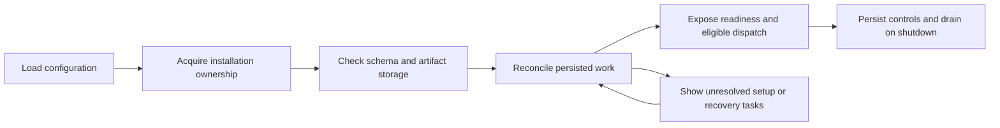

# Local Operations, Diagnostics and Verification

**Version:** 0.4 · Proposed implementation design

## 1. Runtime and distribution

Ship a single-user local web application. Development continues with Node 24 and the checked-in pnpm workspace. The first production package serves the built React assets and API from the same loopback origin, starts the local worker, and supervises the chosen director runtime. A desktop wrapper, hosted multi-user deployment, and direct timeline editor are later products.

Separate installation paths from user data. A configured data directory stores SQLite/artifacts/snapshots/logs, while the checkout or packaged application holds code. Initial compatibility testing should include the user's macOS environment and Linux CI; publish the actually tested OS/architecture matrix with the first release. Do not promise Windows/native dependency support before clean-machine verification.

Bootstrap steps: load validated non-secret settings; acquire an installation ownership lock; check application/schema compatibility; migrate with backup when needed; initialize artifact storage; open local HTTP and worker services; verify selected runtime/skill/provider configuration; expose readiness. A fake-provider mode starts without API keys, Codex or paid access. A real-production mode reports missing prerequisites as setup tasks instead of silently downgrading capabilities.



Recovery runs before new submissions. Unresolved jobs remain held with their liability recorded; they need not prevent unrelated work that passes its own admission checks.

## 2. Configuration and credentials

```ts
interface InstallationConfig {
  schemaVersion: number;
  dataDirectory: string;
  listen: { host: "127.0.0.1"; port: number };
  mode: "fake" | "production";
  maxExportSeconds: 360;
  worker: { enabled: boolean; maxConcurrentLocalTasks: number };
  directorProfileId: Id | null;
  ffmpegPath: string | null;
  ffprobePath: string | null;
}
interface CredentialStore {
  resolve(reference: string): Promise<string>;
  set?(reference: string, secret: string): Promise<void>;
  remove?(reference: string): Promise<void>;
}
```

Implement an environment-reference credential backend first; it works for contributor and CI setups without putting secrets in project files. The settings UI can select validated environment references and show configured/not-configured status. Add an OS-keychain backend for saved keys on the first supported desktop platform; typed-key saving is unavailable until that backend exists. Do not silently save form input to plaintext application settings. An ignored user-managed `.env` is an explicit local configuration choice, not part of exports.

The backend passes only the chosen LLM credential to the director runtime and only required media credentials to a worker invocation. Redact auth headers, secret values and signed URL query parameters from logs. API responses return masked status/reference names. A provider connection check that incurs usage must be distinguished from read-only configuration validation and covered by the user's allowance.

Changing defaults affects future plan/profile resolution. Active locked work keeps its identity; [framework upgrade rules](SKILLS-TOOLS.md) govern successor locks. Provider outage fallback is a presented decision, not silent substitution.

## 3. Process lifecycle and recovery

One active server owns an installation; workers have identities and lease epochs. A second application instance attaches to the existing UI or reports the existing owner instead of starting another dispatcher. PID files alone are insufficient across crashes/reboots; combine an OS-held lock with an installation generation token and process liveness. Workers verify installation ownership before new admission.

On normal stop, persist dispatch/director pause as appropriate, stop claiming new work, flush known provider evidence and allow bounded completion of local artifact writes. Accepted remote tasks may continue after all local processes exit. On restart, resume monitoring/reconciliation from durable records before any new submission. A local crash cannot retract a remote charge.

FFmpeg and other trusted local operations run in child processes with explicit argument arrays, bounded concurrency, timeouts and cancellation. Capture sanitized stderr for diagnostics. Stop the child process tree on cancellation and keep incomplete output in staging. A killed render can restart from its frozen manifest; it does not regenerate source video.

The future Python H3 worker has its own accepted-work records and transferable artifacts; it never reads installation SQLite or local application paths. Remote worker liveness is not proof of generation failure; reconciliation uses accepted job identity and capability-specific evidence.

## 4. Observability and debug evidence

Use structured logs with `projectId`, `requestId`, `changeId`, `planRevisionId`, `logicalNodeId`, `candidateId`, `attemptId`, runtime/profile identity and correlation IDs where applicable. Keep public decision rationale and plan changes, not hidden model reasoning. Rotate logs and make debug export opt-in.

| Signal | Purpose | Evidence source |
|---|---|---|
| Request-to-prepared-plan latency | Detect director/context bottlenecks | Director request and prepared-change timestamps |
| Ready-to-dispatch wait | Distinguish review, budget, capacity and scheduler delays | Node readiness and admission records |
| Provider/inference and ingest duration | Separate remote delay from local transfer/validation | Attempt phase transitions |
| First storyboard/scene preview and edit turnaround | Measure the user experience | Review/render target and publication events |
| Reused takes, new candidates and retry reasons | Verify scoped editing and no quality auto-regeneration | Origin grants, attempts and graph diffs |
| Unknown submissions and unsettled liability | Detect reconciliation work | Attempt state and reservation ledger |
| Stale approval/result rejections | Detect races or unclear review UX | Admission/change/decision error events |
| SQL busy time, event lag, disk/staging growth | Detect local scalability problems | Process/database/artifact diagnostics |

Metrics are diagnostics first. No hosted analytics or remote telemetry is required for v0. Runtime logs, product progress and actual billing evidence remain distinct. A UI “estimated cost” must not be labeled settled spend; provider-reported usage is stored with provenance.

## 5. Test layers and fixtures

Propose Vitest for domain/service tests, real SQLite for persistence/concurrency, Fastify injection for HTTP, and Playwright for browser flows. These are additions for implementation; the existing `pnpm check` currently builds and typechecks only. Pin versions compatible with the repository during setup. [Vitest guide](https://vitest.dev/guide/)

| Layer | Representative cases | What it proves |
|---|---|---|
| Compiler/contract tests | Allowed/rejected AST, graph cycles, prompt freshness, review equality, canonical round-trip | Model output becomes bounded deterministic work |
| Domain/service tests | Narration gap cases, scoped impact, candidate origin, hold ownership | Product rules without paid dependencies |
| Real SQLite integration | Concurrent approve/edit/admit, duplicate commands, migration/backup | Actual transaction and constraint behavior |
| Worker/provider fixtures | Accepted/direct-complete/rejected/unknown outcomes, lost response, duplicate/late receipt, partial download | Durable effect handling and bounded recovery |
| Runtime contract fixtures | Turn streaming/input/interrupt, session recreation, tool replay, unexpected skills | Adapter behavior under the pinned release |
| Browser flows | Exact batch approval, stale review, shot-linked chat, reconnect/pause | Usable human intervention |
| Local media tests | Known audio/video fixtures, trims/overlaps, cue alignment, six-minute duration | Render and timing correctness |
| Bounded live pilots | One approved image/video/speech/transcription path, then short sequence | Actual account/provider compatibility |

Fake operations must expose controllable barriers at submission intent, provider acceptance, receipt recording, ingest and publication. Race tests release those barriers in prescribed orders using a controlled clock. Count simulated provider accepts, not only tool calls, to detect duplicate paid effects. Restart an actual worker process in recovery tests; resetting a JavaScript object is insufficient evidence.

Prompt/skill evaluations use small scenario fixtures: notes-only narration, complete uploaded audio, partial mixed sources, one-shot framing edit, same-setup extra take, stale approval, ambiguous scope and a user pause. Score tool outcomes and persisted invariants. Creative quality is reviewed by people; a model score cannot admit retries. Keep deterministic fixtures in ordinary CI and separately version any live runtime/model evaluation samples.

## 6. CI and release gates

Extend CI in slices: build/types, domain tests, real SQLite integration, a small browser smoke flow, then selected local-media fixtures. Paid calls require explicit opt-in credentials and a bounded allowance and are never default PR checks. Tests must not load a contributor's personal Codex skills or media keys.

A six-minute release candidate must pass the fake full-length workflow, a measured real production example within budget, restart/recovery invariants, review/quality-origin rules, export/import and installation verification. Record actual model/runtime/profile versions and hardware. Do not promise a speed multiplier or thirty-minute readiness from short clips.

For each PR run the tests that exercise its changed behavior plus required CI checks. Broaden testing after new failures, integration changes or unresolved risks; repeated full-suite runs without a new reason do not add much evidence. The [development workflow](../development/CODEX-WORKFLOW.md) explains how to scope Codex implementation and independent reviews.
