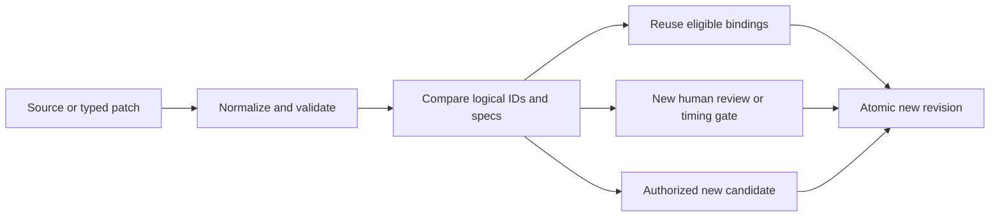

# OpenSlate — Plan Compiler and Atomic Changes

**Version:** 0.4 · September 10, 2026
**Status:** implementation specification; proposed contracts, not implemented APIs.
**Ownership:** `packages/core` compiler/change modules; server invokes creative-state transactions. Read [Execution and Editing](../design/EXECUTION-AND-EDITING.md) for product behavior, [Data and Persistence](DATA-PERSISTENCE.md) for shared records, and [Execution Engine](EXECUTION-ENGINE.md) for dispatch.

## 1. Responsibility and boundaries

The compiler translates restricted TypeScript plan source or a typed patch into immutable operation specifications, dependencies, and an impact report. It never calls a provider, reserves money, approves a keyframe, or executes generated JavaScript. Applying a prepared change publishes creative state and execution bindings atomically; workers subsequently admit eligible jobs.

V0 supports six operation families: image generation, video generation, speech synthesis, transcription/alignment, timeline assembly, and rendering. Asset/shot references and human-review gates are graph primitives, not additional paid operations. Every video consumes its reviewed conditioning image. The initial output profile uses 30/1 frames per second and 48 kHz audio; the final timeline must fit 360 seconds after trims and overlaps. Source generation length may exceed edit length for handles.

Project, node, specification, candidate, and artifact identities are opaque UUIDs. Readable source aliases such as `shot7` are local symbols; array position, a title, and a source line number never establish durable identity. A prepared change allocates new service-owned identities once and retains them across idempotent retries.

## 2. Inputs and intermediate representation

These fragments describe compiler contracts. Shared branded IDs and JSON validation belong to the core contracts package.

```ts
type OperationKind = 'image' | 'video' | 'speech'
  | 'transcription' | 'timeline' | 'render';

type InputSource =
  | { kind: 'artifact'; artifactId: ArtifactId; sha256: string }
  | { kind: 'output'; nodeId: NodeId; port: string };

interface InputBinding {
  destinationPort: string;
  role: string;                    // schema-defined, e.g. first_frame
  order: number;                   // explicit; singleton uses zero
  source: InputSource;
}

interface CompiledNode {
  nodeId: NodeId;                  // stable logical operation
  specRevisionId: NodeSpecRevisionId;
  operation: { kind: OperationKind; contractVersion: string };
  profileRevisionId?: ProfileRevisionId;
  args: JsonObject;                // strict operation-specific schema
  inputs: InputBinding[];
  timingDependencies: TimingDependency[]; // readiness/provenance, below
  authoredFor: IntentProvenance;    // consumed intent/bible snapshots
  requires: GateId[];
  recipeDigest: string;            // may contain symbolic inputs
}

interface PreparedChange {
  changeId: ChangeId;
  baseProjectRevisionId: ProjectRevisionId;
  baseHeadVersion: number;          // ProjectHead concurrency token
  capabilityLockId: CapabilityLockId;
  creativePatch: CreativePatch;
  sourceDigest?: string;
  graphDigest?: string;
  nodes: CompiledNode[];
  impact: NodeImpact[];
  requirements: PendingRequirement[];
  estimate: ProductionEstimate;    // no reservation
}
```

The complete graph also contains output-port schemas, mechanical edges, review-gate descriptors, source locations, and a logical-ID map. Every candidate consumes an immutable service-issued `grantSlotId`, bound to an authorized purpose and scope, exactly once. Initial plan approval or a scoped human request creates these bounded slots. Consumption uniqueness is independent of logical node ID: renaming or duplicating a node cannot reuse a grant. Technical recovery authorizes another attempt under that candidate, not another slot or creative candidate. Agent-authored IDs cannot grant authority.

Operation schemas define destination ports, accepted source types, roles, cardinality, explicit list ordering, and which effective values contribute to hashes. Reject duplicate destination/role/order bindings, undeclared ports, gaps where a dense list is required, or unsupported role combinations. Preserve order unless the descriptor explicitly defines a set and its canonicalization. Hash these semantics with the operation contract; adapters cannot silently reinterpret ordered references.

Store the submitted source, canonical source projection, normalized graph, parser/compiler identity, and capability lock with the plan revision. Preserve submitted source for audit even when later typed patches produce canonical source. The graph is authoritative for execution; source edits must pass preparation and commit.

## 3. Restricted syntax and parser

Use a pinned `@babel/parser` behind `PlanSyntaxParser`. Parse a program with `sourceType: 'module'`, `strictMode: true`, `errorRecovery: false`, and the TypeScript plugin; then apply OpenSlate's own exhaustive allowlist. Babel documents these parsing options and TypeScript support. Its accepted language is much broader than OpenSlate's DSL. [Babel parser documentation](https://babeljs.io/docs/babel-parser)

The repository's TypeScript 7.0.2 build-tool dependency does not establish availability of the historical JavaScript compiler API. Do not depend on `typescript.createSourceFile`, use the native compiler as a runtime parser, or install a transpilation fallback. Pin the selected Babel version during implementation and record it in compiler compatibility fixtures.

Accept one `definePlan` call with a literal header and one non-async arrow body containing `const` declarations and a final return. Values are finite literals, arrays, plain object fields, prior local symbols, or explicitly registered `p.*` declaration helpers. Helpers lower into IR; they are never invoked as JavaScript functions. Resolve symbols through a compiler-owned map.

Reject imports/exports, arbitrary functions, loops, branches, assignments, spreads, computed properties, getters, classes, destructuring, `new`, optional chaining, template interpolation, and unrecognized type wrappers. Reject duplicate object keys and dangerous prototype keys; construct maps without inherited properties. Every AST node and nested expression must be visited. Valid TypeScript outside this subset is still a diagnostic.

Initial configurable limits are 2 MiB source, 5,000 normalized nodes, 20,000 edges, and depth 64. Parse in a bounded worker thread with a deadline and memory limit, then validate AST depth/count. This protects the application event loop even before post-parse checks. No `eval`, `Function`, VM execution, generated imports, or filesystem/network calls occur.

## 4. Preparation algorithm

1. Capture a consistent project snapshot, active plan, locked descriptors, profile revisions, controls, and relevant output bindings using a short read transaction. Close it before parsing.
2. Parse and lower source, or apply a typed patch to the stored canonical IR. New full-source submissions still map existing operations through explicit logical IDs.
3. Resolve project references and operation schemas. Fill only documented profile defaults; missing creative choices remain requirements. Retain exact effective prompt strings and every consumed intent/bible dependency.
4. Type-check source/destination ports, roles, cardinality, ordering, and operation hash rules; reject missing nodes, cross-project references, unsupported modes, and cycles. Compute topological order and reverse adjacency. Semantic influence edges are stored separately from execution-readiness edges.
5. Validate video review requirements, profile compatibility, and narration dependencies. Pending speech, cues, or keyframes are valid symbolic inputs. Preparation operations must compile before their outputs exist. Video dispatch requires the affected measured timing; a resolved final timeline and export enforce the duration ceiling.
6. Compare normalized specifications with the active graph. Calculate reuse, compatible-in-flight, replace, re-review, reassemble/render, and retire classifications, including their causes.
7. Estimate work from versioned local rate/capacity descriptors. Flag unknown totals or unbounded prices; estimates do not promise provider invoices or reserve funds.
8. Persist the prepared change and its digests under command idempotency. Return diagnostics and requirements together, without modifying the active plan. Never hold a write transaction across parsing or estimation.

Fresh provider capability discovery happens outside preparation and is recorded as a profile revision. A changed capability snapshot requires revalidation instead of silently altering the prepared request.

## 5. Exact review and prompt freshness

Each human-review item resolves to the displayed final conditioning `ArtifactRef`, generation-relevant shot intent, effective motion prompt, requested duration/frame rate, resolved video profile/settings, and relevant relative timing constraints. Construct its approval digest from these normalized values. Candidate identity is excluded so an explicitly requested same-setup take can reuse approval.

Image cropping, padding, or other conditioning changes occur before review and produce a new artifact. Refreshing a signed URL for identical bytes does not change approval. The compiler compares the review descriptor with the video operation; the worker repeats that equality check at dispatch after symbolic inputs resolve. A missing gate is rejected even if generated source omits it. Approval originates in the human decision service, never in a `p.humanReview` declaration.

Prompt provenance is a separate check from byte-level cache matching. A wardrobe/action/framing change makes an old prompt stale even when its text is unchanged. Require reauthoring or explicit reconfirmation under the updated intent. V0 binds a conservative generation-relevant snapshot; narrower field dependencies require tested descriptors. The compiler checks freshness, not artistic correctness.

Narration cue revisions identify actual measured audio; their source-range and propagation contracts are defined in [Narration](NARRATION.md). `TimingDependency` names an immutable cue revision or future cue output and its purpose: readiness, generation semantics, or edit placement. These are separate from actual provider input bindings. For video, derive generation-semantic digests from explicitly consumed narration text/constraints and relative timing, not the whole waveform hash, absolute placement, or a newly allocated cue ID. This is a conservative field comparison, not automatic proof that two sentences mean the same thing. Changed text requires reauthoring/reconfirmation when it affects shot intent. Rendering instead consumes exact audio artifacts and absolute sample/frame ranges. A placement-only shift can preserve video and approval after a validated timing rebind; changed duration, meaning, or motion requires affected review.

## 6. Diff, cache identity, and in-flight reuse



Canonical serialization sorts object keys, preserves ordered arrays and exact strings, and rejects non-finite numbers. Integer frame/sample values avoid floating-point timing drift. A recipe digest includes symbolic input bindings and locked operation behavior; a final execution fingerprint substitutes resolved input hashes and exact effective settings. Neither contains ephemeral URLs or UI labels.

An identical final fingerprint makes media eligible for reuse; it never suppresses a deliberately requested candidate. Reuse requires compatible intent provenance and an allowed selection. Deterministic derivatives can use content-addressed caches directly. A patch may record an explicit compatibility binding to the same running candidate/attempt and effective inputs even when a cue/spec revision ID changes. Preserve the attempt's original provenance; the new binding records the equivalence check. A changed global revision alone is irrelevant.

Unresolved changed upstream inputs prevent declaring a downstream result reusable. Preserve it as an option, wait for resolution, then compare finalized fingerprints. Retired nodes retain their attempts, liabilities, and artifact history.

## 7. Atomic commit and edit holds

An edit hold is persisted before director reasoning. Its initial scope covers the target and known potentially affected semantic dependents and execution consumers. Expansion blocks further dispatch; already dispatched work remains monitored. Controls compose: clearing this edit's hold cannot clear a user pause or another edit.

Preparation occurs outside the write lock. Applying uses one short `BEGIN IMMEDIATE` transaction:

```text
load prepared change; verify digest, idempotency and expected revision
verify actor/request authorization epoch, scope, edit ownership and lock
verify current requirements without adopting another request's authority
recheck affected bindings; consume each authorized grantSlotId at most once
publish project revision + source/graph revision + active bindings
retire obsolete unsent work; create authorized generation intents
retain compatible attempts and all existing financial liabilities
append domain events; mark prepared change applied
release/narrow only this edit's hold; COMMIT
```

There are no provider calls, `await`s, parser execution, or money reservations inside this transaction. Dispatch performs financial admission later. Job progress can change during preparation; compatible completion is retained, while a conflicting selection or creative revision returns `REVISION_CONFLICT` and requires reprepare/rebase. Do not silently merge overlapping creative edits.

A project-only change may commit without an execution graph. If it invalidates running intent, the same transaction marks affected bindings blocked/stale and retains their hold until a fresh executable plan or explicit decision resolves it. Discarding an edit restores eligibility only where all remaining controls permit it.

## 8. Diagnostics and acceptance tests

Diagnostics include stable code, node/field path, source range when available, explanation, and corrective choices. Examples: `SYNTAX_NOT_ALLOWED`, `UNKNOWN_OPERATION`, `OUTPUT_TYPE_MISMATCH`, `DEPENDENCY_CYCLE`, `STALE_PROMPT_INTENT`, `REVIEW_SPEC_MISMATCH`, `PROFILE_INCOMPATIBLE`, `TIMING_REQUIRED`, and shared `REVISION_CONFLICT`. Pending timing/review is a requirement, not a fabricated value or necessarily a compilation error.

| Test | Required result |
|---|---|
| Unsupported syntax nested inside an otherwise valid object | Reject; no execution fallback |
| Parser deadline, oversized input, deep AST | Bounded failure; server remains responsive |
| Canonical round trip and whitespace-only edit | Same normalized semantics and reuse decisions |
| Missing review or motion/profile mismatch | Video cannot become dispatchable |
| Audio/keyframes planned before cues exist | Preparation compiles; dependent dispatch stays blocked |
| Intent changes but prompt text does not | Freshness requirement, no automatic cache reuse |
| Unrelated scene edit during generation | Compatible in-flight candidate survives |
| Completion races with patch commit | One consistent binding; no stale selection overwrite |
| Same request replay versus explicit additional take | Idempotent change versus distinct authorized candidate |
| Renamed node reuses an already consumed grantSlotId | Reject duplicate candidate authority |
| Cue replacement changes only absolute placement | Preserve video fingerprint; update exact render inputs |
| User pause plus completed scoped edit | User pause remains effective |
| Late tool applies after its authorization epoch is revoked | Reject before canonical mutation |

Add fixture tests for every registered operation and parser version, property tests for normalization/diff invariants, and SQLite integration tests for commit races. Compilation correctness is tested with fake artifacts; live provider behavior is outside this component's proof.
