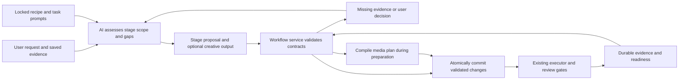

# Production Workflow and Stage Contracts

**Version:** 0.5 · September 10, 2026
**Status:** target workflow contract; consult [implementation status](../implementation/STATUS.md) for shipped behavior and verification. The [unified film-plan design](../design/SIMPLIFIED-VIDEO-FLOW.md) defines the next user-facing projection and material-first intake flow.

## 1. Responsibility and decision boundary

The director interprets the user's input, identifies useful stages and missing information, and proposes scoped work. OpenSlate validates that proposal against versioned stage contracts and canonical evidence. The workflow guides filmmaking without assuming one fixed sequence or allowing the model to waive a critical boundary.

Keep three concerns separate: the workflow chooses and validates the current task; the director produces creative proposals; the [plan compiler](PLAN-COMPILER.md) validates media operations and their dependencies. Workflow code is trusted application TypeScript. Agent-authored plan code remains a restricted declaration language and never executes arbitrary JavaScript.



Ownership: `packages/core/src/workflow` contains stage schemas, pure prerequisite checks and relevance rules; `apps/server/src/application/workflow-service` persists stage records through existing change services; `packages/director` assembles focused task context. Reuse the current request supervisor, events and execution engine. Do not add another scheduler, provider dispatcher, generic workflow framework or seventh media operation family.

## 2. Flexible guidance and enforced rules

| Concern | Director judgment | Application enforcement |
|---|---|---|
| Stage selection | Decide whether this request needs intake, story, shots, narration, revision or another supported stage | Validate registered stage, scope, prerequisites and current authority |
| Missing information | Interpret an incomplete brief, unclear tone, missing story motivation or conflicting instructions | Preserve observations/questions; validate known required fields and decision/evidence references |
| Creative development | Write story beats, scene intent, shot action and prompts; propose exceptions to suggested order | Validate typed outputs, links, duration bounds, provenance and permitted mutations |
| Stage completion | Propose that the requested work has been addressed | Derive readiness from committed outputs and required evidence; model labels cannot grant acceptance |
| Media production | Propose needed assets, jobs or an explicitly requested replacement | Enforce exact keyframe approval, grants, budgets, holds, timing, idempotency and submission recovery |

Recipe guidance includes suggested ordering, filming practices and examples. Hard predicates encode only requirements the application can actually verify. “The story is compelling” is guidance and human judgment; “every shot references an existing scene revision” is a structural check. Schema validity does not establish truth, artistic quality or complete understanding of a brief.

An AI-reported gap is a proposal with evidence references, not a new permanent rule. Distinguish a registered hard requirement from a creative concern. The director can resolve a creative concern through a revised proposal or a user decision; it cannot dismiss a hard requirement. Unsupported proposed extensions remain discussion until application code/contract support is added. No general `skipValidation` or `markApproved` escape hatch exists.

## 3. One recipe, independently progressing scopes

Start with the `narrated-video` recipe and these registered stage IDs. Create/revise is an intent mode of a stage, not a separate global pipeline.

| Stage | Typical output or evidence | Entry and reuse behavior |
|---|---|---|
| `intake` | Brief, attachment inventory, source choices, pending questions | Reuse settled decisions; inspect new inputs rather than restarting the interview |
| `story` | Story beats and overall visual direction | Draft from available intent; preserve explicit unresolved creative choices |
| `scene_plan` | Scoped scene purposes, order, narration coverage and provisional durations | Can develop alongside narration; depend on relevant story/brief inputs |
| `shot_plan` | Shot intents, references, timing assumptions and draft prompts | Create or patch one shot/scene; validate links to its current scene and constraints |
| `narration` | Script/audio/cue revisions and readiness | Branch between existing recording, missing passages and generated narration |
| `storyboard` | Planned/usable conditioning images and exact review snapshots | Pending audio timing may allow image preparation; approval binds actual resolved inputs |
| `video` | Planned/admitted jobs and usable takes | Compile with unresolved inputs if explicit; dispatch requires all current review/timing/policy predicates |
| `assembly` | Timeline, preview or export target | Draft with pending selections; render only a resolved manifest |
| `review` | Displayed plan/media, exact decisions or a scoped revision request | Approval and quality feedback remain separate from technical completion |

There is no authoritative `project.currentStage`. Each scene/shot can have several stage instances, with status derived from current revisions. One scene's videos can run while another waits for narration. The UI shows this as scope-specific progress, not a forced wizard.

Existing user material can satisfy an output requirement after ingestion, validation and any required acceptance. A final recording skips script invention; it still needs usable audio, accepted transcript/source choices and measured timing where consumed. An imported storyboard can satisfy image requirements after normalization and review. Skipping how an output was created does not skip the requirements on its use.

Draft prerequisites are deliberately weaker than paid-dispatch prerequisites. Otherwise requiring final timing before creating the narration plan would create a dependency deadlock. The media graph remains acyclic; revisiting a creative stage creates a successor stage instance/revision, not a cycle inside the execution DAG.

## 4. Contracts and saved records

Illustrative trusted application configuration, not syntax newly allowed in the planning DSL:

```ts
defineStage({
  id: "shot_plan",
  contractVersion: "1",
  modes: ["create", "revise"],
  promptRef: "production/plan-shots@1",
  draftRequires: ["current-scene-intent", "relevant-visual-constraints"],
  outputSchema: "ShotPlanProposal@1",
  commitChecks: ["authorized-scope", "fresh-inputs", "valid-scene-links"],
});
```

The trusted registry resolves those check IDs to application functions and the prompt reference to pinned bytes. No model-selected function name becomes executable code. A task may return an output proposal, `needs_input`, or an unsupported-path explanation; waiting is a valid saved outcome.

```ts
interface StageProposal {
  stageId: string;                  // validated against the locked recipe
  scope: { kind: "project" | "scene" | "shot"; id: Id };
  mode: "create" | "revise";
  basedOn: RevisionId[];
  reason: string;                   // concise public explanation
  gapObservations: GapObservation[];
}

interface StageRun {
  id: Id;                          // service-issued, replay-stable
  projectId: Id;
  stageId: string;
  scopeId: Id;
  intentRequestId: Id;
  recipeDigest: Digest;
  stageContractDigest: Digest;
  promptDigest: Digest;
  inputDigest: Digest;
  inputBindings: StageInputBinding[];
  bindingVersion: number;          // contract, intent and input/output targets
  progressVersion: number;         // derived status/evidence updates
  status: "ready" | "active" | "waiting_input" | "waiting_evidence"
    | "satisfied" | "blocked" | "failed" | "superseded";
  outputRevisionIds: RevisionId[];
  decisionIds: Id[];
}
```

`StageInputBinding` records exact revision lineage and the fields consumed for freshness. A stage's aggregate input digest uses those declared fields rather than an unrelated project head change. Exact revisions remain available for audit. V0 conservatively invalidates on relevant field changes; semantic equivalence requires a recorded validated rebind rather than the model asserting “same meaning.”

Fence material bindings with `bindingVersion`. Resolving an expected pending output or changing derived progress alone increments `progressVersion`; it must not force a new creative proposal or another LLM turn. At commit, revalidate current predicates and retain compatible completion evidence. A changed contract, intended scope, consumed input or selected output target requires reprepare/rebind. Do not use the latest event sequence or progress version as a blanket creative concurrency token.

`GapObservation` contains a stable scoped key, category, evidence references and suggested question/options. The service maps registered categories to hard requirements; the model cannot supply their severity or closure authority. Keep observations and dispositions versioned. `satisfied` means this stage's defined output requirement is met; a valid story draft is not automatically human-accepted, and a technically usable video is not automatically creatively approved. Display those distinctions explicitly.

Add `workflow_runs` (recipe/lock/active lineage), `stage_runs`, `stage_inputs`, `stage_outputs` and `workflow_assessments` to the persistence model. Link to existing user requests, director requests, gaps, pending decisions, plans and artifacts; do not duplicate them. Workflow status changes have per-record versions and durable events but do not advance the creative project head unless creative revisions also change.

## 5. Assessment, preparation and advancement algorithm

1. Persist the user request, applicable edit hold and authority fencing using the existing API protocol. Read current scope, stage readiness, relevant decisions and recent evidence.
2. The director proposes one or more supported stages and missing information using the locked production guide. A simple request can include its creative draft/patch in the same proposal; routing need not incur a separate LLM call.
3. `prepare_change` accepts a workflow variant containing stage proposals plus optional typed creative changes/media-plan source. Normalize the creative diff and compile any media graph during preparation; derive mandatory stage/check coverage from that actual mutation footprint for every input variant. A model cannot label a shot/video mutation as `intake` to obtain weaker checks. Validate membership, scope, relevant input freshness and actual prerequisites against a proposed-state overlay in dependency order when a bounded batch includes predecessor outputs; persist only the prepared proposal at this point.
4. Return the eligible work, unresolved hard requirements, proposed questions and impact. A blocked stage may prepare work that produces its missing prerequisite. It cannot submit blocked media or invent satisfied evidence. Preparation never creates active execution or approval.
5. `apply_change` rechecks the authorization epoch, immutable prepared payload, project/read-set versions, stage binding versions and current stage predicates inside the same transaction as creative changes. Progress-only completion retains compatible work without another model call. Commit stage records and compatible creative/plan revisions together; otherwise commit none. Every variant receives service-derived contract coverage and stage bindings from its actual mutation footprint.
6. Reconcile stage status from committed outputs, user decisions and executor evidence. A completed director turn alone changes no stage to satisfied. Save pending questions in application records; ordinary conversation resumption does not rely on an in-memory function stack.
7. Advance already authorized deterministic work without another director turn. Wake the director only when creative selection, missing information or interpretation is needed. Deduplicate/coalesce wakeups under the existing supervisor, and preserve director/dispatch pauses.

No new tool is required. `read_context` includes a `workflow` view; `prepare_change` carries stage proposals; `apply_change` commits them; inspection and control retain their current roles. Normal stage advancement needs no new user confirmation when already authorized. Required keyframe review and new creative spending remain governed by their existing decisions.

Stage IDs/proposals are model-supplied references, never authority. The service validates their ownership and creates immutable bindings to the authorized request, scope and prepared change. Delayed creative/stage publication must match those bindings and current input/binding versions. This does not reject or discard executor receipts, artifacts or liability: retain late media evidence/history and let the existing current-binding projector decide whether it can become an active selection. A stage transition within unchanged request authority does not require a new runtime process; broader user authority still follows the existing epoch-replacement protocol.

## 6. Edits, replay and versions

For “make shot 7 a close-up,” assess `shot_plan` in revise mode for that shot, retain the current story/scene constraints, and prepare its framing/prompt change. The impact analysis marks affected storyboard/video work stale. Generate only the authorized replacement keyframe, obtain exact review, then admit replacement video and update assembly. Unaffected scenes and valid old outputs remain available.

Replay uses the service-owned intent and prepared-change identity. A new model call ID, stage label or routing attempt cannot allocate another creative candidate or reset an allowance. Matching stage inputs make prior outputs eligible for reuse, but an explicit user request for an alternative is a distinct scoped intent. A prior recipe/prompt record does not authorize silently regenerating existing media.

Pin recipe, stage-check implementation, prompt and output-schema digests in the capability lock. Task prompts are references inside the two existing skills; do not create a skill per stage or a separate prompt loading system. A software/prompt update creates a successor lock for future work under the existing upgrade rules. Old stages retain their versions and results; changes do not restart the film. Update prompt examples and evaluation fixtures with a changed contract.

Recovery reconstructs pending stages from SQLite, reconciles director command receipts and executor evidence, and then computes eligible work. Lost acknowledgment never causes blind director/media replay. A stage waiting on an uncertain external submission remains attached to that attempt and liability. Stage metadata cannot override `submission_unknown`, user holds or retired output bindings.

## 7. Prompting, performance and acceptance evidence

Each task context names the selected scope, requested output, relevant settled decisions, available evidence, missing hard requirements, allowed change shape and a few relevant examples. The recipe provides suggested methods; code handles structural contracts and hard gates. Short public routing explanations aid debugging; private model reasoning is not stored.

Logical stages do not imply one LLM call each. Batch related scene/shot/prompt work when dependencies are available, reuse relevant context and re-evaluate only affected scopes. V0 retains one active director turn per project; independent media work remains parallel. Additional concurrent LLM workers require a separate tested design, not an implicit `forEach` fan-out. Measure model calls/tokens, time to useful storyboard, edit turnaround and avoidable rework before claiming a speed gain.

Bound schema/protocol correction attempts for malformed proposals and stop with actionable diagnostics when they fail. Do not let repeated stage reassessment run without new evidence, user input or a changed valid proposal. Quality improvement does not authorize automatic media retries.

| Acceptance case | Required behavior |
|---|---|
| Complete narration upload versus notes-only brief | AI proposes different paths; validated existing outputs are reused |
| AI claims a frame is approved without a matching decision | Video admission stays blocked |
| AI reports a nonessential creative gap | Present an advisory choice; do not fabricate a hard prerequisite |
| Storyboard preparation before narration timing exists | Preparation proceeds where valid; affected video stays gated |
| Shot-only request while other scenes generate | Enter the relevant revise stage; preserve compatible work and pauses |
| Stage changes or inputs change during a late output | Reject/reprepare stale commit; no overwrite of current bindings |
| Compatible media completes during proposal preparation | Preserve completion; progress alone does not require another model call |
| User explicitly asks for another take with identical inputs | Reuse unchanged review when valid, but allocate the separately authorized candidate |
| Repeated assessment with no progress | Bounded correction or waiting state, not an autonomous loop |
| Batched story/scene outputs, mislabeled intake proposal or existing plan-only tool variant | Derive checks from the actual diff; no alternative route around contracts |
| Process restart or prompt upgrade | Reconstruct state/retain versions; no duplicate creative candidates |

Use fake director outputs and real service transactions for contract tests, plus small live prompt evaluations when explicitly enabled. Human review evaluates whether suggested stories and options are useful; passing mechanical tests proves only the corresponding boundaries.
