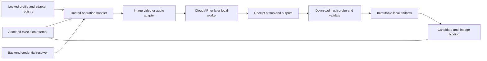

# Media providers and immutable artifacts

**Version:** 0.4 · September 10, 2026
**Status:** detailed design; no provider integration or paid generation is implemented by this document.

## Boundary and ownership

The worker invokes role-specific adapters for image, video, speech, and transcription operations. The application owns job admission, human review, budgets, and current selections. An adapter translates one validated operation into a provider protocol; it cannot create another creative take, silently substitute models, or mutate the active plan.



`packages/providers` owns wire translation and fixtures; `packages/core` owns normalized contracts and policy; trusted worker handlers orchestrate lifecycle and artifact ingest. Credentials resolve inside the backend/worker. Profiles reference secret identifiers; neither keys nor provider authorization headers enter plans, director context, browser reads, or ordinary debug exports.

## Profiles and adapter contracts

```ts
interface MediaProfileRevision {
  id: ProfileRevisionId;
  role: "image" | "video" | "speech" | "transcription";
  adapterId: string;
  adapterBuildDigest: string;
  modelId: string;
  credentialRef: string;
  endpointConfigRef: string;
  capabilityRevision: string;
  settings: JsonObject; // validated by this adapter's versioned schema
}

interface ArtifactRef { artifactId: ArtifactId; sha256: string }

interface VideoRequest {
  profileRevisionId: ProfileRevisionId;
  shotRevisionId: ShotRevisionId;
  conditioning: {
    mode: "first_frame";
    image: ArtifactRef;
    reviewItemId: ReviewItemId;
    approvalDigest: string;
  };
  motionPrompt: string;
  durationFrames: number;
  frameRate: { numerator: number; denominator: number };
  settings: JsonObject;
}

type SubmitResult =
  | { kind: "accepted"; receipt: ProviderReceipt }
  | { kind: "completed"; receipt: ProviderReceipt;
      outputs: OutputDescriptor[] }
  | { kind: "rejected"; certainty: "not_accepted";
      error: ProviderError }
  | { kind: "unknown"; diagnostic: ProviderDiagnostic };

interface MediaAdapter<Request> {
  validate(request: Request, profile: MediaProfileRevision): ValidationResult;
  submit(request: Request, context: AttemptContext): Promise<SubmitResult>;
  poll(receipt: ProviderReceipt): Promise<PollResult>;
  reconcile(attempt: AttemptSnapshot): Promise<ReconcileResult>;
}
```

Contracts are role-specific: image requests carry ordered reference artifacts, prompt, and output geometry; speech carries exact text and voice; transcription carries audio and required timing granularity. `poll` returns unsupported for synchronous protocols, rather than fabricating a remote task. `reconcile` returns found, proven absent, or unknown; absence requires protocol evidence. A similar timestamp, prompt, or output cannot prove identity.

Capabilities declare conditioning modes, valid duration sets, geometry constraints, audio behavior, maximum input sizes/counts, polling, idempotency, and cancellation semantics. Validation rejects unsupported input combinations before reservation. Profile changes create immutable revisions; active attempts retain their original profile and adapter build. A hosted alias may change behind that identity, so record requested and provider-reported resolved model IDs separately, with null when undisclosed.

Input transport is also a capability: multipart bytes, embedded image data, or provider-accessible URLs. The H3 integration probe must verify embedded local keyframe transfer against its request-size limit. If a profile requires hosted URLs, require an explicit artifact-transport configuration; never expose the local server publicly or silently upload references to a new host. Transfer receipts retain original artifact hashes so transport does not alter approval identity.

`ProviderReceipt` retains adapter/profile/attempt identity, external task or request ID, acceptance timestamp, and bounded sanitized response metadata. `OutputDescriptor` is either worker-spooled bytes or a provider download locator, with optional expiry and reported media properties. Locators are protected operational data, not artifact identities. `ProviderError` separates auth, invalid input, policy rejection, rate limit, technical transient, terminal technical failure, and unknown; trusted code owns the classification.

## First integrations and compatibility gates

**GPT Image 2.** Keep the user's chosen `gpt-image-2` family. Use the Image API directly from the worker; image inputs use the edit/reference path. Explicitly set geometry and quality, validate selected-model constraints, and ingest returned bytes. Current GPT Image 2 guidance supports high-fidelity image inputs and says to omit the nonconfigurable `input_fidelity` parameter. Do not copy defaults from another image model. [Model reference](https://developers.openai.com/api/docs/models/gpt-image-2), [Image guide](https://developers.openai.com/api/docs/guides/image-generation)

**H3 cloud.** The documented initial route is `POST /v2/video_generation` with `MiniMax-H3`, text plus first-frame image content; poll `GET /v2/query/video_generation/{task_id}`. The create contract currently lists 4–15 integer seconds and separate resolution choices. First-frame and reference-media modes cannot mix; image-to-video geometry follows the input image. Therefore put product references into the keyframe-generation step and reject incompatible video requests. Normalize any required image format, crop, or dimensions **before human review**, then send those exact conditioning bytes. A resize after approval creates a new artifact and needs renewed approval. [Create contract](https://platform.minimax.io/docs/api-reference/video-generation-v2-create)

Successful H3 query responses contain a direct video URL and usage; the current query window is seven days. Ingest promptly and report any unrecoverable expired lookup rather than buying a replacement. Do not implement the older Hailuo file-ID retrieval protocol for this profile. [Query contract](https://platform.minimax.io/docs/api-reference/video-generation-v2-query)

H3's cancel/delete route cancels queued work but rejects running cancellation; on completed work it deletes the provider task record. A poll-then-cancel sequence can race completion. V0 therefore implements local dispatch stop and continued monitoring of accepted work; automatic remote cancellation stays disabled until a safe adapter contract is demonstrated. [Cancel/delete contract](https://platform.minimax.io/docs/api-reference/video-generation-v2-delete)

**Audio.** Start with configured OpenAI speech and transcription adapters as described in [Narration](NARRATION.md). Required timing granularity is a capability, not an assumption shared by all transcription models. The initial cloud installation needs no Python or GPU dependencies.

These published schemas are integration inputs, not evidence of this user's access, latency, pricing, output quality, or reliable recovery. Pin fixtures to the tested profile, and require a small authorized integration probe before enabling it for production. No exact-once submission guarantee is claimed for these providers.

## Submission and recovery algorithm

1. Resolve immutable inputs, verify artifact hashes and active review binding, validate capabilities, and reserve costs through the engine. Record an attempt before network I/O.
2. Persist its exact canonical request digest, model/settings, known input hashes, and client correlation ID. Do not include signed URL query parameters in the execution fingerprint.
3. Submit once with automatic transport/SDK POST retries disabled unless provider idempotency is tested. Serialize updates through the attempt's lease/fencing check.
4. Store an accepted receipt immediately, or ingest synchronous outputs. Timeout/disconnect after possible acceptance becomes `submission_unknown`; an HTTP 5xx is not blanket proof that nothing started.
5. Poll known tasks with persisted backoff and jitter. Throttling slows the shared provider queue. Authentication errors hold dependent new work; polling failures do not create a new generation.
6. Obtain outputs, commit validated artifacts, then bind the attempt/node output. The server completion projector alone advances draft take selections; worker output does not select itself into the current film. A file-download failure retries download; a probe failure retains the original and technical diagnostic. A bounded technical retry retains the same candidate and receives a new attempt ordinal, trusted failure record, and reservation. A user-requested creative replacement receives a new candidate; neither case erases prior charges or unknown liability.

Costs use integer currency micros (`bigint` internally, decimal strings at JSON boundaries). Keep estimated, reserved, provider-reported usage, and reconciled charge separate; a timeout does not release liability. Missing pricing/usage is unknown rather than zero. Price-card revision and currency accompany estimates; enforce a money cap only with a conservative per-call upper bound, otherwise use the user's explicit unit/job allowance. Provider output validity checks are technical—decode, stream type, dimensions, duration tolerance—not aesthetic scoring. Only the user requests creative alternatives.

## Artifact store and ingestion protocol

The application data root contains `artifacts/sha256/<prefix>/<digest>` and `staging/<attempt-or-upload-id>/`, matching the shared persistence layout. An artifact row has UUID, project association, SHA-256, byte count, MIME/type, relative blob key, probe version/result, origin, and creation time. One physical blob may back multiple logical artifacts; lineage and project access are separate rows. Derivatives retain parent hashes and a transform recipe/build digest.

1. Stream incoming bytes into an attempt-owned temporary file with byte limits and incremental SHA-256. For remote URLs allow only supported HTTPS locators from the adapter; validate redirects and destination addresses, keep provider authorization away from third-party downloads, and never follow a model-supplied arbitrary URL.
2. Finish writing and explicitly synchronize temporary-file contents to durable storage, then close, probe and decode within CPU/time limits. Check expected output count/type and relevant media contract. Preserve suspicious bytes separately from usable artifacts.
3. Install validated bytes atomically on the same filesystem under their hash. Synchronize the destination directory after rename, plus any newly created directory ancestry needed to make that path durable. If the blob exists, verify its size/hash before reuse; never overwrite mismatching content. Implement this as one platform-tested durable-install helper, not an assumption that rename alone establishes power-loss durability.
4. Only after the durable-install barrier succeeds, commit artifact metadata, lineage and attempt output binding in a database transaction and emit availability. A database failure can leave an unreferenced blob, which reconciliation may recover. A failed or unavailable synchronization guarantee leaves the output pending validation rather than usable. On startup, verify pending installs and quarantine any missing/mismatching blob already referenced as usable, blocking its consumers and surfacing recovery. The fenced current reconciler consumes any late immutable output evidence from an older worker lease.
5. On startup sweep abandoned temporary files after lease reconciliation. Garbage collection is a separate explicit operation based on all historical references, active jobs, and export manifests; do not delete old takes merely because they are no longer selected.

Media inspection uses a pinned `ffprobe`/decode toolchain and records actual stream properties. [ffprobe documentation](https://ffmpeg.org/ffprobe.html) Original uploads remain unchanged; thumbnails, waveforms, normalized media, and render caches are immutable derivatives. Browser delivery resolves authorized artifact IDs into local streams and supports range requests; raw filesystem paths and provider locators are not browser API inputs.

## Local workers later and verification

A local H3 adapter will speak an authenticated, versioned HTTP job protocol to a Python service. The worker receives task IDs, immutable media transfers, settings and capability requirements; it has no SQLite access, no director session, and no authority to release review or budget gates. Persist request identity before GPU execution, return durable receipts, advertise build/weights/capability revisions, and support restart queries. Cloud and local profiles remain distinct, including any missing upscaling/audio stages.

Contract tests cover each normalized status/error, delayed receipts, repeated polling, expired outputs, SDK retry disabling, input-role rejection, hash corruption, forged review data, stale-result binding, and model-profile changes. Crash tests cut execution before submission, after remote acceptance, during download, after blob rename, after directory synchronization, and before database commit. Exercise failed/unsupported synchronization and startup quarantine. Document the tested filesystem/OS guarantees; process-kill tests alone do not prove power-loss durability. A second fake provider with incompatible capabilities must run through the same engine without model-specific branches. Local protocol fixtures verify duplicate request reconciliation and prove that remote workers cannot modify project state.
