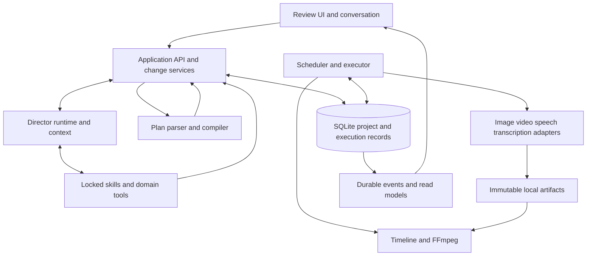

# OpenSlate — Detailed Technical Design

**Version:** 0.4 · September 10, 2026
**Status:** implementation proposal. The repository still contains the original runnable skeleton; these contracts and modules are not implemented.

The [architecture overview](../design/README.md) and [component overview](../design/COMPONENT-DESIGN.md) explain direction. This set defines implementation boundaries, records, interfaces, algorithms, failure handling and verification. Examples describe target contracts, not a stable public SDK. The [development plan](../design/IMPLEMENTATION-PLAN.md) orders the work after these designs.

## 1. Component map



| Component | Detailed design | Initial code ownership |
|---|---|---|
| Canonical state, revisions, persistence | [Data and persistence](DATA-PERSISTENCE.md) | Core contracts; server persistence repositories |
| HTTP commands, trusted actors, transactions, events | [Application API](APPLICATION-API.md) | `apps/server/src/application`, `http`, `events` |
| Codex adapter and context across requests | [Director runtime](DIRECTOR-RUNTIME.md) | `packages/director`; server supervisor |
| Skill locking, registration and five tools | [Skills and tools](SKILLS-TOOLS.md) | Director catalog/bridge; shared core contracts |
| Restricted TypeScript and graph/change compilation | [Plan compiler](PLAN-COMPILER.md) | `packages/core/src/planning` |
| Admission, scheduling, attempts, budgets, recovery | [Execution engine](EXECUTION-ENGINE.md) | Server executor modules; separate worker entry point |
| Narration discovery, synthesis and cue changes | [Narration](NARRATION.md) | Core narration domain; director references; audio adapters |
| Model profiles, adapters and artifact handling | [Providers and artifacts](PROVIDERS-ARTIFACTS.md) | `packages/providers`; server artifact service |
| Timeline resolution, mixing and exports | [Timeline and rendering](TIMELINE-RENDERING.md) | Core edit domain; server media worker |
| Human review, playback and conversational editing | [Review UI](REVIEW-UI.md) | `apps/web` |
| Local installation, diagnostics, testing and operations | [Operations and testing](OPERATIONS-TESTING.md) | Server bootstrap; test fixtures; CI |

These are module boundaries. Create additional workspace packages only when they acquire independent consumers or lifecycle needs. Runtime/database/provider imports must not enter browser bundles; provider clients do not own canonical project state.

## 2. Shared contract conventions

The following conventions resolve cross-document ambiguity. Domain-specific records extend them rather than inventing competing identities.

```ts
type Id = string;                 // service-issued opaque UUID
type RevisionId = Id;             // immutable record identity
type MicrosDecimal = string;      // nonnegative integer decimal at JSON boundary
type Digest = string;             // lowercase SHA-256 hexadecimal

interface ArtifactRef { artifactId: Id; sha256: Digest }
interface Money { currency: string; micros: MicrosDecimal }
interface ProjectHead {
  projectId: Id;
  revisionId: RevisionId;
  headVersion: number;            // optimistic concurrency, not event sequence
  activePlanRevisionId: RevisionId | null;
  capabilityLockId: Id | null;
}
interface ProjectEvent<T = unknown> {
  eventId: Id;
  projectId: Id;
  sequence: number;               // monotonic per project
  kind: string;
  occurredAt: string;             // UTC ISO timestamp
  correlationId: Id;
  payload: T;
}
```

Use branded TypeScript IDs in implementation to prevent accidental interchange. Model-authored labels such as `shot-7/take` are symbols mapped to service-issued logical IDs. UUIDs themselves do not provide idempotency. Every mutating command needs a trusted intent identity and request digest; duplicate handling is described in the [API](APPLICATION-API.md).

Use integer money micros, `bigint` internally and safe SQLite integer bindings; serialize as decimal strings. Never add different currencies or silently convert credits to money. Initial monetary caps require a conservative enforceable per-call bound; otherwise use an explicit unit/job allowance and label money as an estimate. Admission limits OpenSlate's activity, not unrelated usage of the same vendor account.

Editorial time is integer frames at a rational frame rate, initially 30/1; audio positions are integer samples, initially 48,000 Hz. Seconds in conversational/provider interfaces are converted at explicit boundaries. Absolute rational conversions avoid accumulated rounding drift. The six-minute limit applies to resolved export duration after trims and transitions, not the sum of provider clip lengths.

## 3. Invariants across every component

1. OpenSlate's database is authoritative; conversation history, UI caches and worker memory are not.
2. Project/plan/spec revisions and artifacts are immutable. Heads, job state and explicit selection bindings may change through owned commands.
3. Every video admission requires current human approval of its exact reviewed conditioning bytes and effective shot/video specification.
4. Creative candidates consume immutable service-issued grant slots from an initial authorized plan or a scoped recorded user request. Technical retries retain the candidate and allocate a new attempt backed by trusted failure evidence and retry allowance. Approval plus unused budget is insufficient.
5. `submission_unknown` remains a potential paid effect; lease expiry, timeout and user edits do not authorize blind resubmission.
6. Source/graph validation has no media side effects. Preparation can describe pending narration timing; affected dispatch and timeline resolution enforce readiness.
7. Scoped changes preserve compatible work. Completion of an old candidate cannot replace a newer selected candidate.
8. A patch clears only its own hold. All user pauses, other holds and remaining gates still apply.
9. Keys are backend-only references in plans/logs. The embedded production runtime cannot inherit development skills or alternate paid-tool routes.
10. Technical correctness and creative acceptance are separate. The user controls quality-driven regeneration; useful draft previews need not wait for individual clip acceptance.

## 4. Proposed implementation baseline

Keep the checked-in Node 24, TypeScript 7 and pnpm baseline. Add dependencies through implementation PRs with lockfile updates, rather than pinning untested versions in prose. Select `better-sqlite3` behind repositories, JSON Schema contracts validated with Ajv/Fastify, a TypeScript-capable `@babel/parser` behind a narrow syntax adapter, and FFmpeg/ffprobe child processes with argument arrays. The pinned TypeScript toolchain is not assumed to expose the older JavaScript compiler API.

The parser choice is supported by Babel's documented TypeScript syntax plugin; it is only a parser, so OpenSlate still rejects every AST form outside its language. [Babel parser](https://babeljs.io/docs/babel-parser)

Default process layout: one local HTTP application plus one local TypeScript worker, each with its own SQLite connection and short transactions. Server application services own creative mutations; executor repositories own job progress and admission under shared current-state checks. Additional local workers use the same leases; remote GPU workers never open the database. The production Codex process is a separate restricted runtime launched by the backend.

## 5. How to use this design

Read shared contracts and data/API boundaries before implementing a component. Work on one vertical slice with its relevant documents and acceptance cases. If a prototype disproves a library or contract assumption, record the evidence and update this set in the same PR. Keep unresolved external compatibility checks explicit; do not replace them with an undocumented assumption.

For developing the software with Codex/GPT-6, see the separate [development workflow research](../development/CODEX-WORKFLOW.md). Those development instructions are not the two production skills used by the video agent.
