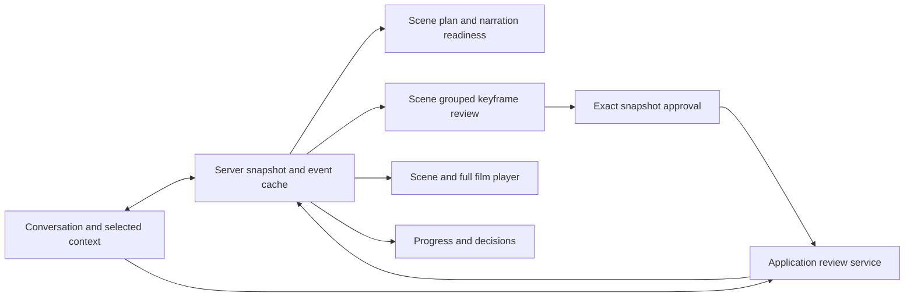

# Review Workspace and Conversational Editing

**Version:** 0.4 · Proposed implementation design

## 1. Product contract

V0 gives the user a conversation, a scene-oriented review workspace and playback. Every creative edit is expressed through conversation. Selecting a frame/shot/timecode supplies context for that conversation; approve, pause and playback controls are available directly. A timeline editor is a later interface over existing change services.

The primary flow is: brief and narration options → concise production plan → narrated storyboard/keyframe review → clip/scene draft review → final playback/export. Each stage can coexist with progress in other scenes. The application keeps the last usable preview visible during revision.

## 2. Components and data contracts

| React component | Reads | Actions |
|---|---|---|
| `ProjectShell` | Project head, stages, pending decisions and connection status | Navigate review sections, reconnect |
| `ConversationPanel` | Persisted messages plus transient deltas | Send message with explicit selected context and upload references |
| `NarrationPanel` | Text/audio readiness, gaps, script revision, audio player and cues | Choose offered direction/voice option, attach audio, send scoped feedback |
| `ProductionPlanCard` | Scene summary, duration, narration direction and preparation estimate | Accept presented plan/allowance or request changes |
| `StoryboardReview` | Immutable scene review snapshot and member status | Enlarge/compare, select shot for chat, approve explicit displayed subset |
| `ShotReviewCard` | Keyframe, intended motion, duration, candidate/attempt status | Play take, compare to keyframe/history, attach shot/timecode to chat |
| `PreviewPlayer` | Frozen timeline/render target and shot interval map | Play/seek, select active shot, download current chosen export |
| `DecisionTray` | Review, scope, budget, conflict and failure decisions | Resolve exact decision or continue conversation |
| `ExecutionStatus` | Ready/running/held/failed counts and estimated/observed usage | User pause/resume within scope |
| `DebugInspector` | Detailed shot spec, plan source/graph and event lineage | Read/copy/download redacted diagnostic bundle |

These names describe future module ownership, not a mandatory component library. Reuse React and native media elements; choose visual styling primitives in implementation. Keep provider and filesystem details out of ordinary creative review.

## 3. State management and transport

The backend owns durable state. Keep query caches keyed by `(projectId, resourceId, revisionId)` and a small UI state store for selected scene/shot, playback position, unsent draft and open panels. Do not duplicate business-state reducers in browser code. The SSE handler invalidates/refetches relevant resources or applies versioned small changes; it cannot grant approval or advance job states locally.

Boot: obtain a consistent snapshot/event cursor, open the event stream after that cursor, and merge events by monotonic sequence. Persist only unsent draft and UI selection locally if desired. After disconnect, mark stale status, retain the preview, and restore canonical state on reconnect. Transient streaming text is replaceable by the final persisted message.

Sending a message creates a client command key that survives a request retry. Optimistically show “sending” text, but never optimistically show paid jobs as admitted or reviews as approved. If server acknowledgment is lost, retry the same command key. Show the persisted server request ID once known.

## 4. Narration and storyboard interactions

The narration panel displays what exists and what is missing, for example: “Script: partial; audio: none; remaining: closing message and voice.” Offer two or three context-relevant choices, plus free text. A user can upload a finished recording without being forced through script writing. Show a transcript as editable through chat; explain when a requested text change requires new audio rather than implying the waveform changed.

Storyboard batches default to scenes. Each frame shows a stable shot label, the image, intended motion, approximate edit duration and narration excerpt. A concise scene summary remains visible; provider prompts and technical settings are in the debug inspector. An optional animatic provides timing context using the approved narration and still frames.

“Approve scene” names the exact displayed batch. Users can exclude members or provide chat feedback against selected cards. The request carries snapshot digest/member IDs, and the backend returns accepted or stale members. If input changes while the user is reviewing, visibly mark changed cards and disable submitting the old full-batch approval until refreshed. Unchanged members retain their valid approval.

The UI separates “keyframe approved,” “video running,” “draft ready” and “user accepted.” A still approval cannot be displayed as proof that the generated motion is good. A technically valid take automatically appearing in a draft remains reviewable; the agent does not purchase a better-looking take without user intent.

## 5. Editing an active production

User selects shot 8 and writes, “Make the toe shape match the uploaded photo.” The client sends that shot plus the current review/preview reference. The application persists a hold before model processing. Show an editing badge for affected work while unrelated approved scenes proceed.

The director returns a compact impact card: changed keyframe/shot, reusable references/takes, affected successor if any, extra generation allowance and pending review. On success, the UI shows the replacement frame and requests renewed approval before video; the old frame/take remains in history. If the edit only changes trim/captions, explain the updated timing/render and preserve video generation.

If the scope is ambiguous, the decision tray asks a focused question and indicates the temporary hold. Completing an edit cannot clear the user's pause. An abandoned/crashed edit exposes “continue this edit” or “discard pending edit and resume prior plan” as explicit actions; it does not resume spending silently.

Selecting an older take for reuse is a conversational change. The preview player displays the exact timeline revision being shown while a newer target is pending, so “current working plan” and “last available preview” do not get confused.

## 6. Review usability and scale

Use stable scene/shot labels and timestamp-to-shot mapping. Support keyboard navigation, visible focus, descriptive labels, audio controls and captions. Thumbnails/proxies keep the grid responsive; fetch full media only on inspection/playback. Paginate or virtualize review batches as shot count grows; six-minute support must not load every full-resolution frame/video into browser memory.

Keep action text concrete: “Approve 6 displayed keyframes,” “Video waiting for frame approval,” “Previous preview; shot 8 replacement is rendering.” Estimated cost and time must be labeled estimates. Show uncertain submissions separately from ordinary failures so the user is not invited to create an accidental duplicate.

## 7. Acceptance tests

Browser tests cover uploaded and generated narration choices, approving a displayed subset, stale approval rejection, full playback/timecode context, editing one active shot, user pause surviving edit completion, and reload/reconnect during a pending decision. A six-minute fake project checks thumbnail loading and event reconnect without unbounded memory growth. Test accessibility with keyboard-only review and media labels. Use stable fake artifacts and a controlled clock; paid provider calls are not UI test prerequisites.
