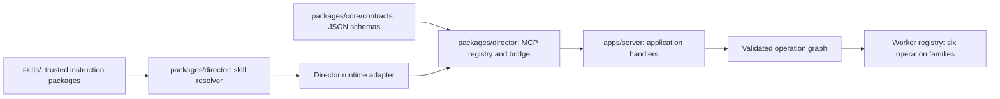

# Skills and tools technical design

**Version:** 0.4 · September 10, 2026
**Status:** proposed implementation. This document adds no installed skills, MCP server, handlers, or application code.

## 1. Three separate extension mechanisms

A skill teaches the director how to reason. A tool invokes a bounded application service. An operation executes trusted worker code from the compiled plan. Skill text cannot register a handler, widen permissions, approve a keyframe, or authorize another paid candidate.



Keep these modules inside existing packages initially. `packages/core` owns shared schema/type definitions; `packages/director` owns discovery, activation, descriptors, and transport; `apps/server` owns authorization and mutations. The worker owns operation handlers and executor-repository admission. Neither skills nor the MCP bridge access SQLite directly.

The initial surface is deliberately complete but small:

| Kind | Initial IDs |
|---|---|
| Skills | `production`, `plan-authoring` |
| Tools | `read_context`, `prepare_change`, `apply_change`, `control_execution`, `inspect_artifact` |
| Operations | Image, video, speech synthesis, transcription/alignment, timeline assembly, render |

Narration, continuity, reference reuse, shot grammar, provider prompting, and editing examples are lazy references within those two skills. Additional operation handlers do not automatically require additional model tools.

## 2. Package format and content identity

Each instruction package contains a native `SKILL.md`, an OpenSlate manifest, and referenced guidance/examples. Initial packages are instruction-only; executable scripts, dependency installation, and remote package loading are excluded from this version.

```text
skills/production/
  SKILL.md
  openslate.skill.json
  references/narration.md
  references/continuity.md
  references/review.md
```

```ts
interface SkillManifest {
  id: string;
  version: string;
  entry: "SKILL.md";
  files: string[];
  compatibility: {
    toolContract: string;
    planLanguage: string;
  };
  requiredToolIds: ToolId[];
}

interface ResolvedSkill {
  id: string;
  version: string;
  packageDigest: string;
  immutableRoot: string;
  entryPath: string;
}
```

These are proposed schema-derived types. Validate unique IDs, bounded file sizes, entry frontmatter, declared references, and compatible contract versions. Resolve real paths; reject path traversal and symlinks escaping the package. Build a canonical manifest of normalized relative paths and exact file hashes, then hash that manifest. Include all instruction/reference/example bytes; timestamps and source checkout locations do not define identity.

Copy the verified package into content-addressed immutable storage before use. Verify the snapshot digest after copying and publish it atomically. Local edits cannot alter an active snapshot. A missing or changed referenced file is a package error, not a reason to load an unpinned replacement.

Codex natively discovers skill name/description/path before loading full instructions when selected. `SKILL.md` is the native baseline; optional runtime metadata belongs to the adapter. OpenSlate's manifest, digest, and lock are application features. [Native skills](https://learn.chatgpt.com/docs/build-skills)

## 3. Catalog, lock, and request activation

The catalog lists trusted available packages and handlers. A capability lock selects exact skill digests, tool/operation contract versions, handler builds, compiler identity, and relevant runtime/provider profile revisions for a production boundary. Request activation records identify what OpenSlate explicitly supplied for one request: lock ID, context snapshot ID, selected skill IDs/digests, and entry paths.

Do not claim an activation proves that the model read every reference or obeyed instructions. The application can record its own injection and mediated reads, but opaque runtime file access does not necessarily provide complete reference-consumption events.

At startup, resolve the lock, verify snapshots and handlers, start the fixed MCP bridge, then compare effective runtime skill/tool discovery with the allowed catalog. Account for documented bundled/system skills explicitly; reject conflicting domain names and unexpected enabled capabilities outside the tested baseline. A dedicated runtime state directory does not alone remove user, ancestor, admin, or system skill sources. [Discovery scopes](https://learn.chatgpt.com/docs/build-skills)

For each request, build fresh project context, select `production`, `plan-authoring`, or both, and explicitly inject pinned skill entry paths through the adapter. Use production for clarification, creative decisions, narration gaps, review, and edits. Add plan-authoring once sufficient intent is settled to write or patch executable plan source. Reinject at request boundaries after compaction or session replacement; do not rely on prior conversation text as a version lock.

Native App Server supports skill listing, explicit skill inputs, and listing invalidation/reload behavior. Reloading a listing neither freezes package bytes nor removes instructions already in a conversation. Runtime-specific root configuration can be process-scoped, so isolate project configuration and test it against the pinned release. [App Server skills](https://learn.chatgpt.com/docs/app-server)

## 4. Upgrade and extension algorithm

Existing requests and jobs retain their original locks. An unlocked profile, new skill digest, runtime change, or handler upgrade creates an explicit successor lock and production-run/plan boundary. Hold affected new dispatch, validate compatibility, recompile/rebind affected future work, and replace runtime context when necessary. Existing provider jobs continue under their original inputs and implementations; do not resubmit them.

Keep old worker handler builds available until their jobs complete, or require an explicit compatible migration. Merely updating instructions does not invalidate completed media. A resulting creative/input/operation change determines invalidation. Switching among profiles already included in the lock remains a scoped change with renewed affected human review.

Add a new skill only for a distinct trigger and output contract; add a reference for another recipe. Add an operation by registering its schema, trusted implementation, dependency/effect rules, capabilities, and recovery tests. Add a model tool only when existing typed commands cannot express the required application action. No marketplace or hot installation is needed.

## 5. Tool descriptors and trusted invocation context

Define contracts JSON-schema-first in `packages/core/contracts`; derive TypeScript types and MCP input schemas from the same source. Validate with the application's schema validator and reject unknown fields on command variants.

```ts
type ToolId = "read_context" | "prepare_change" | "apply_change"
  | "control_execution" | "inspect_artifact";

interface ToolDescriptor {
  id: ToolId;
  contractVersion: string;
  inputSchemaId: string;
  outputSchemaId: string;
  effect: "read" | "prepare" | "commit" | "control";
}

interface InvocationContext {
  projectId: Id;
  authorityRequestId: Id;          // immutable authorization-origin request
  authorizationEpochId: Id;
  bridgeInstanceId: Id;
  capabilityLockId: Id;
  actor: TrustedActor;
  correlationId: Id;
}

type ToolResult<T> =
  | { ok: true; receiptId?: Id; value: T }
  | { ok: false; code: ToolErrorCode; retryable: boolean;
      message: string; currentRevision?: RevisionId };
```

Invocation context comes from an immutable authenticated bridge credential-to-epoch mapping, never from model arguments or a mutable current-request pointer. Each call captures its original context at arrival. Model-supplied scope IDs are checked against it. Actors, approval authority, candidate origins, budget permissions, and technical-error eligibility cannot be forged through JSON fields.

The stdio MCP bridge connects only to the local server using a process-fixed opaque credential resolving to one project and authorization-origin request/epoch. It forwards fixed commands, not arbitrary HTTP requests. Keep the credential out of model arguments, context, responses, and logs. Every mutation, including proposal publication and controls, verifies the epoch remains mutation-enabled inside its commit transaction. Revocation can therefore fence a call already being processed.

V0 replaces the process/bridge when request authority changes; it never lends an old bridge new rights. Persist the edit hold and revoke the previous epoch, interrupt/drain or terminate, then create the new credential. Native steering requires unchanged scope/authority. Read-only follow-ups/events reuse the existing epoch, which may monotonically become read-only after its mutation request settles. A late revoked-credential call fails with `AUTHORIZATION_EPOCH_REVOKED`. Test this mechanism with the pinned runtime; do not substitute model-claimed request IDs for proven attribution. See [runtime fencing](DIRECTOR-RUNTIME.md#6-input-scheduling-edits-and-wakeups).

## 6. Five command contracts

| Tool | Inputs and outputs | Required rules |
|---|---|---|
| `read_context` | Typed view, scope IDs, optional cursor; bounded snapshot and revisions | Enforce project scope; paginate large collections; return artifact IDs rather than arbitrary paths |
| `prepare_change` | Base revisions, typed creative change and/or plan source/patch; prepared ID, impact, diagnostics, estimate | Validate without paid work; bind normalized proposal and input hashes; preserve edit hold |
| `apply_change` | Prepared ID and expected revisions; committed revision and durable receipt | Revalidate immutable proposal, origin, scope, policy, lock, and freshness atomically |
| `control_execution` | Typed action, scope, expected control revision; resulting controls | Release only caller-owned edit holds or explicitly authorized pauses; never erase accepted work |
| `inspect_artifact` | Known artifact ID plus bounded inspection variant; media metadata/preview/evidence | Enforce project access, storage containment, supported modality, and response limits |

Project-only preparation is valid before a plan exists and stores a proposal only. `apply_change` commits settled creative decisions without generation intents. If that commit changes active production inputs, retain the affected hold/stale bindings until a compatible executable plan resolves them. Discussion notes do not automatically invalidate work.

Plan source is the bounded TypeScript planning language, parsed and compiled into supported operations; it is never evaluated as arbitrary JavaScript. Preparation returns concrete compiler/impact findings. Application commits may establish authorized generation intents, but the worker executor performs final admission/reservation under current holds, budget, dependencies, and gates.

Every video requires human approval covering the exact keyframe and current shot intent/settings. Scene batch approval records exact coverage. Candidate origins are `initial_slot` or `user_change`; each consumes one immutable service-issued `grantSlotId`, bound to its permitted purpose independently of logical node identity. Recreating a node cannot reuse the slot. Trusted technical evidence may grant `RetryAuthority` for another attempt of the same candidate, not another creative candidate. Quality criticism cannot grant it.

## 7. Idempotency, lifecycle, and errors

Register and validate descriptors at application startup, resolve their pinned implementations, then expose the fixed five-tool MCP catalog for the runtime session. Skill activation never adds tool names. Codex supports MCP allowlists and stdio/HTTP transports; OpenSlate owns contract compatibility and application authorization. Return promptly with persistent IDs instead of holding MCP calls open for long media work. [MCP integration](https://learn.chatgpt.com/docs/extend/mcp)

Persist mutation receipts with their state changes in short transactions. After authenticating the current epoch, an authorized `apply_change` retry against the same prepared ID returns its existing receipt before attempting a new commit; a different payload cannot reuse that identity. The supervisor can reconcile old receipts through its own application authority after epoch revocation. New native call IDs do not create generation identities. Stable intents/grant slots survive fresh requests and session replacement. Control commands use service-issued identities and control revisions for equivalent replay protection.

Preparation may create durable proposal records but cannot reserve spend or submit media. Expire proposals by explicit retention policy; reject expired preparation with instructions to prepare against current state. Never silently apply a fresh interpretation of an old prepared ID.

Use structured errors such as `REVISION_CONFLICT`, `SCOPE_DENIED`, `CAPABILITY_MISMATCH`, `PREPARED_CHANGE_EXPIRED`, `HUMAN_REVIEW_REQUIRED`, and `ORIGIN_NOT_AUTHORIZED`. Return bounded corrective details and current relevant revision. `retryable` describes a safe identical transport retry, not permission for another paid attempt. Log correlation IDs and receipts; redact secrets and excessive media/prompt data.

## 8. Acceptance tests

Test package hashing with changed references, traversal/symlinks, missing files, duplicate names, and immutable snapshots. Test catalog discovery with inherited unexpected skills and disabled dependency installation. Verify two requests reactivate the same locked instructions while using fresh project state.

For all five tools, test schema rejection, cross-project IDs, forged authority fields, response limits, stale revisions, and lost responses after commit. Test old-credential arrival after replacement and epoch revocation between validation/commit. Replay a change after recreating its node and native call IDs: its grant slot still permits one candidate. A quality retry fails without user authority; technical recovery uses trusted evidence for a same-candidate attempt. Test exact review mismatch, another hold's release, and preparation that leaves canonical creative state unchanged.

Finally, register a fake additional operation without changing the five-tool catalog, upgrade a skill while an old job runs, and recover a replaced Codex session without replaying side effects. The fixed surface is adequate only if these cases pass with fake media before live generation is enabled.
