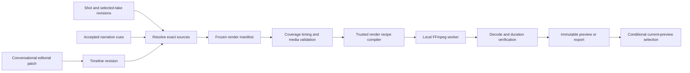

# Timeline assembly and rendering

**Version:** 0.4 · September 10, 2026
**Status:** detailed design; the initial implementation supports conversation-driven edits, not a direct timeline editor.

## Ownership and composition model

The timeline service turns narrative order and selected takes into an immutable editorial document. A resolver binds that document to exact usable artifacts; a renderer compiles the resulting manifest into trusted FFmpeg operations. Neither FFmpeg commands nor mutable filenames are the timeline's source of truth.



V0 includes one ordered visual track, narration, an optional music bed, optional clip-native audio, basic captions and a supplied-logo/end-card overlay. Cuts are the default transition; an explicitly selected crossfade can be supported once timing tests pass. Playback, scene review and contextual chat use this structure without exposing an editing canvas. A later editor submits the same validated editorial patch operations.

## Time and typed contracts

Use integer frames for picture timing and integer samples for audio. V0 uses a 30/1 constant-frame-rate export profile and 48 kHz working audio. Preserve rational frame-rate fields so later profiles can use rates such as 30000/1001. Do not infer project frame rate from the first provider clip. Values are validated safe integers; arithmetic involving products/division uses `bigint` internally and checked conversion at contract boundaries.

```ts
interface FrameRate { numerator: number; denominator: number }
interface FrameRange { start: number; end: number } // [start, end)
interface SampleRange { start: number; end: number }

interface TimelineClip {
  id: TimelineClipId;
  shotId: ShotId;
  shotRevisionId: ShotRevisionId;
  takeId: TakeId;
  source: FrameRange; // frame indices in canonical CFR derivative
  atFrame: number;
  durationFrames: number;
  fit: "contain" | "cover";
  transitionOut: { kind: "cut" } | { kind: "crossfade"; frames: number };
}

interface AudioPlacement {
  id: AudioPlacementId;
  artifactId: ArtifactId; // normalized 48 kHz waveform
  cueRevisionId?: CueRevisionId;
  source: SampleRange;
  atSample: number;
  gainMilliDb: number;
  fadeInSamples: number;
  fadeOutSamples: number;
}

interface RenderManifest {
  id: RenderManifestId;
  timelineRevisionId: TimelineRevisionId;
  frameRate: FrameRate;
  totalFrames: number;
  width: number;
  height: number;
  sources: ResolvedArtifactBinding[]; // IDs, hashes, exact transforms
  clips: TimelineClip[];
  audio: AudioPlacement[];
  captions: ResolvedCaption[];
  outputProfileRevisionId: RenderProfileRevisionId;
  toolchainDigest: string;
}
```

At normal speed, `source.end - source.start === durationFrames`. Speed changes and reverse playback are deferred instead of implicitly compensating for a short generated clip. Store transitions separately from content intent; crossfade overlap changes total film length and must be accounted for in placement.

`sourceSample → projectFrame` uses nearest rounding of `sample × fps.numerator / (sampleRate × fps.denominator)` for absolute boundaries. Round each absolute boundary once and derive intervals by subtraction. Convert project frame endpoints back to samples with the documented corresponding rule; the final audio track is padded/trimmed only to this explicit render boundary. A narration cue outside that boundary is a validation error, not permission to cut speech. At 30/1, every frame boundary is exactly 1,600 samples.

## Persistence and resolution

Persist immutable timeline revisions with their originating project revision and editorial patch. Store render manifests, render jobs, outputs, and selections separately. A manifest contains no unresolved “latest take” reference, provider URL, arbitrary filesystem path, or model prompt. Every source resolves to a usable artifact in the same project; lineage connects it to its take and operation fingerprint. Text overlays and fonts are exact artifacts/settings in the manifest.

The render fingerprint includes exact narration audio hashes, source ranges, mix settings and placements because rendering consumes them. This differs from a video-generation fingerprint: a narration-only edit can require a new render while preserving existing video when validated meaning and relative shot timing remain unchanged. A cue's whole-audio hash or new revision ID is not, by itself, a reason to regenerate an unconditioned video.

Current-take selection can change while an older render runs. The older manifest remains valid history. The worker commits its output binding; the server completion projector publishes the preview through a conditional transaction checking that the active timeline/input selection still matches the manifest. Mismatching output becomes historical and cannot replace the current preview. A new unrelated project revision does not invalidate an identical manifest.

Draft preview and export have explicit coverage policies. A preview may contain labeled keyframe placeholders for pending shots, but placeholders are never represented as generated takes or accepted final video. A full export requires complete resolved coverage, no placeholders, accepted narration choices, and duration within the configured 360-second release limit. Local export does not require a second per-take approval; the user can request it after reviewing the draft.

## Assembly algorithm

1. Load the requested project/timeline revision and ordered shot intent. Resolve exact selected takes and accepted narration/cue revisions; retain explicit source trim ranges and user selections.
2. Normalize source videos into project-compatible CFR derivatives, preserving originals and a source-to-derivative mapping. Record scaling, orientation, pixel format, color conversion, audio handling, and toolchain identity in the derivative fingerprint. Apply portrait/landscape fit explicitly; no hidden crop to make a clip fit.
3. Assign each shot its planned edit duration. Validate that actual usable source frames cover the chosen trim and any transition handles. A provider's requested duration does not prove delivered frame count. Insufficient content requires a scoped user choice: shorten, use another take, or request replacement; do not silently loop or freeze the last frame.
4. Compute ordered clip positions, subtracting approved transition overlaps. Validate no unexplained gaps/overlaps; intentional blank/end-card intervals are explicit clips. Align the narration and music placements against measured samples.
5. Generate sentence-level captions from accepted transcript/cues, apply explicit line wrapping and style, and retain caption-to-segment links. Word-level highlighting is deferred. Changing caption text need not regenerate audio or video unless the change also revises narration meaning.
6. Freeze resolved inputs, editorial settings and toolchain into a render manifest. Hash its canonical form; reuse an existing validated identical output when permitted. Queue a local render operation with disk and CPU admission limits.

Clip normalization can proceed as takes arrive. Scene previews need only their scoped ready sources; the first useful preview need not wait for the whole film. V0 permits rerendering the full six-minute composition after an edit while reusing source takes and normalized media. Scene-output cache stitching is a later optimization after measurements, not a prerequisite for correct scoped editing.

## FFmpeg execution and finishing

The renderer produces argument arrays and a filtergraph from validated data. Launch the pinned executable using `spawn` without a shell; stage approved sources under worker-controlled names. Never accept user/model filter expressions, command fragments, or path interpolation. Caption text uses a generated subtitle/text asset with appropriate escaping; fonts are installed or bundled assets with recorded hashes.

Use explicit video/audio stream mapping. The recipe performs trims and timestamp resets, consistent scaling/pixel format/CFR normalization, concat or approved crossfade, audio placement/mixing, captions/overlays, and output encoding. FFmpeg documents separate filter operations and multiple escaping layers; this is why OpenSlate compiles a restricted recipe rather than exposing raw command strings. [Official filter reference source](https://github.com/FFmpeg/FFmpeg/blob/master/doc/filters.texi)

Default output profile: MP4 with a supported H.264 encoder, AAC stereo, 48 kHz, even dimensions, and web playback metadata placement. The startup capability check verifies the actual installed build includes the required encoders/filters; the profile cannot assume every FFmpeg distribution is equivalent. Preview resolution is lower than final export but preserves framing and duration. Record encoder/settings/build identity; deterministic recipes do not promise byte-identical encodes across different builds or hardware.

Narration stays prominent with an explicit user-approved mix preset. Imported music gain, fades, and optional ducking are recipe parameters. Native generated-shot audio is muted by default in the narrated-commercial preset and can be enabled through conversation. Preserve clean narration and original music as separate artifacts. A two-pass loudness normalization recipe can target the chosen delivery preset; do not let the tool silently choose whether to truncate or extend the film to match the longest input.

The worker reads machine progress, records elapsed time and processed media time, and caps progress below completion until validation succeeds. FFmpeg provides progress reporting for this purpose. [FFmpeg CLI documentation](https://ffmpeg.org/ffmpeg.html) Render into an attempt-owned temporary output, then probe and fully decode it before artifact commit. Verify exact picture frame count, expected dimensions/streams, usable audio duration within codec-padding tolerance, and absence of decode errors. [ffprobe documentation](https://ffmpeg.org/ffprobe.html)

## Editing, failure handling, and tests

`replace_take`, `trim_clip`, `reorder_shots`, `set_transition`, `replace_narration`, and `set_mix` are proposed editorial patch operations. The application validates them under the same revision and hold protocol as other changes. Trimming a ready take invalidates assembly/render outputs, not the provider generation. Replacing a take invalidates its derivative and compositions using it. A framing edit belongs upstream and may need a new reviewed keyframe and video; the renderer must not emulate it silently with a crop.

Local render retries are inexpensive in provider credits but still bounded by time/disk policy. Out-of-space and missing-tool failures hold rendering with useful diagnostics. A worker crash restarts from the immutable manifest; after a completed-file/commit crash, verify the existing temporary output before rerendering. Cancellation terminates only that job's process tree and never deletes input artifacts. Keep the last usable preview visible while the successor renders.

Required tests include mixed input FPS/orientation/resolution; VFR to CFR normalization; sample/frame boundary conversion at 30/1 and 30000/1001; a six-minute audio/video sync fixture; too-short takes; transition overlap math; explicit silent intervals; caption punctuation and path injection; narration edits that only shift placement; preview placeholders blocked from export; and stale render completion. Golden fixtures assert timing/coverage/decoded properties, not brittle byte hashes across toolchains. Render a small supplied-media commercial end to end before enabling paid generation, then measure first scene preview latency, full export time, cache reuse, peak disk, and process memory.
